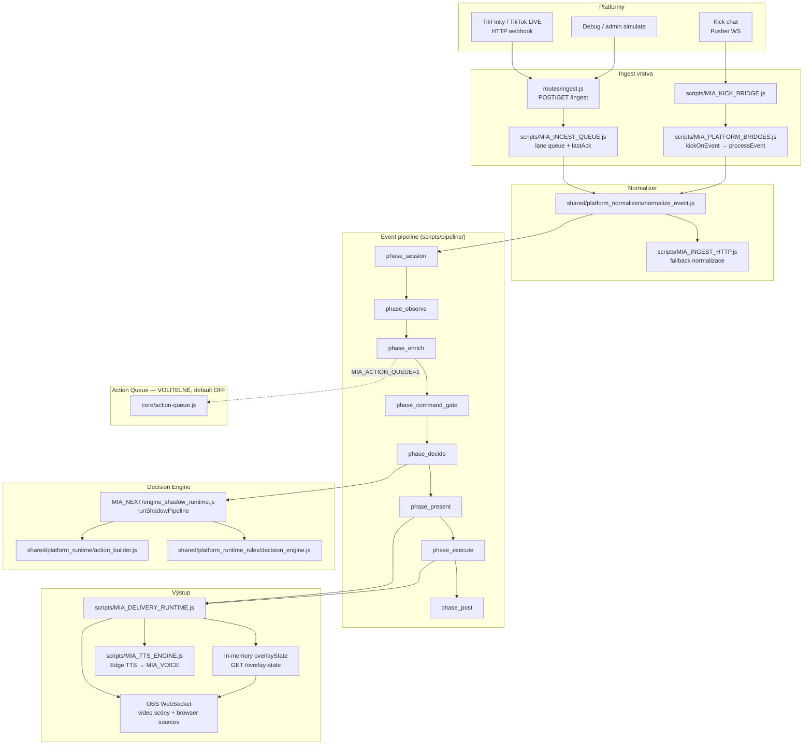
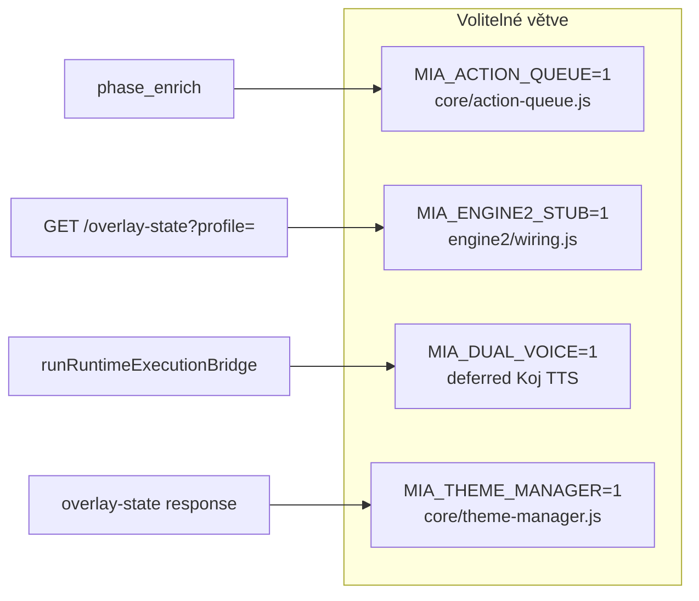

# MIA — Architektonická mapa (Etapa 2)

> **Datum auditu:** 2026-07-27  
> **Scope:** pouze současný stav kódu — žádné návrhy refaktoru  
> **Metoda:** trace z `server.js` → `index.js` → `routes/` → pipeline → delivery  
> **Reference:** `docs/MIA_AUDIT_KROK_MINUS_1/`, ověřeno proti kódu

---

## 1. Executive overview

MIA je Node.js/Express aplikace (`server.js` → `index.js`, ~4461 řádků). Centrální orchestrátor ingest událostí je **fázový event pipeline** (`scripts/MIA_EVENT_PIPELINE.js` → `scripts/pipeline/run.js`). Rozhodování o akci probíhá primárně v **MIA NEXT shadow runtime** (`MIA_NEXT/engine_shadow_runtime.js`), ne v samostatném „Engine2" modulu.

**Kánonický tok (jak má být chápán):**

```
Platform → Ingest → Normalizer → Decision Engine → Action Queue → OBS → Overlays → TTS
```

**Skutečný tok (default runtime, flags OFF):**

```
Platform → Ingest (HTTP nebo Kick bridge) → Normalizer → 8-fázový pipeline
  → phaseDecide: shadowRuntime.runShadowPipeline (MIA NEXT)
  → phasePresent: overlay plán + deliverActionVoice (TTS)
  → phaseExecute: runRuntimeExecutionBridge → executeOverlay + executeVideo
  → GET /overlay-state (OBS browser) + MIA_VOICE browser source (TTS audio)
```

Action Queue (`core/action-queue.js`) a Engine2 stub (`engine2/`) jsou **volitelné větve**, defaultně **neaktivní**.

---

## 2. Kanonický pipeline diagram

### 2.1 Mermaid — hlavní tok (live stream, default flags)



### 2.2 Textový popis po fázích

| Krok | Modul | Co dělá |
|------|-------|---------|
| Boot | `server.js`, `index.js` | Načte ~80+ modulů přes `safeRequire`, spustí Express, zaregistruje routes, bootstrap platform bridges |
| Ingest HTTP | `routes/ingest.js` → `scripts/MIA_INGEST_HTTP.js` | Auth guard, fastAck 200, enqueue do lane queue |
| Normalizer | `shared/platform_normalizers/normalize_event.js` | Syrový payload → `{ eventType, route, platform, user, ... }` |
| Context | `scripts/MIA_EVENT_CONTEXT.js` | Sestaví `ctx` s refs na overlayState, kojnozoutState, streamState |
| Enrich | `phase_enrich.js` | Support resolver, gift economy, viewer memory, director plan, runtime state persist |
| Decide | `phase_decide.js` | `shadowRuntime.runShadowPipeline` → `actionResult` |
| Present | `phase_present.js` | Gift overlays, LLM enhance, **deliverActionVoice** (TTS plán) |
| Execute | `phase_execute.js` | `runRuntimeExecutionBridge` → overlay emit + gift video |
| OBS read | `routes/overlay.js` | Browser sources pollují `GET /overlay-state` |

---

## 3. Reality check — co běží při default flags

### 3.1 Default ON (ověřeno v kódu / config)

| Oblast | Default | Zdroj |
|--------|---------|-------|
| Runtime mode | `MIA_NEXT` | `scripts/MIA_CONFIG.js` → `deriveRuntimeMode()` — `MIA_NEXT_RUNTIME_ENABLED` default `true` |
| Kick bridge | ON | `MIA_KICK_ENABLED` default `true` |
| TTS | ON | `MIA_TTS_ENABLED` default `true`, provider Edge |
| Overlay | ON | `MIA_OVERLAY_ENABLED` default `true` |
| Event log | ON | `config/runtime.json` → `phase1.eventLog.enabled: true` |
| Director | ON | `config/runtime.json` → `phase2.director.enabled: true` |
| Combo moments | ON | `phase2.comboMoments.enabled: true` |
| Viewer memory | ON | `phase2.viewerMemory.enabled: true` |
| Ingest fastAck | ON | `runtimeConfig.ingest.fastAck !== false` |

### 3.2 Default OFF (volitelné cesty)

| Flag / modul | Default | Efekt když OFF |
|--------------|---------|----------------|
| `MIA_ACTION_QUEUE` | **OFF** | Combo momenty se neenqueueují; gift/chat jde přímo pipeline → execute |
| `MIA_ENGINE2_STUB` | **OFF** (`0`) | `engine2/` admin snapshot, overlay profily, plugin loader — neaktivní |
| `MIA_DUAL_VOICE` | **OFF** (unset) | Deferred Koj companion = overlay only, bez druhého TTS |
| `MIA_THEME_MANAGER` | **OFF** | Bez CSS theme vars v `/overlay-state` |
| `MIA_TECH_FORMS` | **OFF** | Bez tech form expiry tick |
| `MIA_USER_MODE` | **OFF** | Telegram user mode stub |
| `MIA_TWITCH_ENABLED` | **OFF** | Twitch bridge nespouští |
| `MIA_TELEGRAM_ENABLED` | **OFF** | Telegram bridge nespouští |
| Shadow runtime | OFF | Pouze pokud `MIA_NEXT_RUNTIME_ENABLED=0` a `MIA_SHADOW_RUNTIME_ENABLED=1` |

### 3.3 Volitelné cesty (zapnutím flagu)



---

## 4. Vstupní body (entrypoints)

| Entry | Soubor | Role |
|-------|--------|------|
| HTTP server | `server.js` | `startMiaServer()` z `index.js` |
| Route registr | `routes/index.js` | 20+ route balíčků |
| Ingest | `routes/ingest.js` | `/ingest`, `/ingest/audience` |
| Overlay poll | `routes/overlay.js` | `/overlay-state`, `/ping-overlay` |
| Admin | `routes/admin.js` | AQ toggle, theme, profiles, engine2 snapshot |
| Platform bridges | `scripts/MIA_PLATFORM_BRIDGES.js` | Kick/Twitch/Telegram startup |

---

## 5. Kde se ukládá stav

### 5.1 In-memory (index.js)

| Proměnná | Obsah |
|----------|-------|
| `overlayState` | `{ miaOverlay, kojnozoutOverlay, chatFeed[] }` — primární zdroj pro OBS poll |
| `outputState` | Proaktivní host, voice hold, session metadata |
| `kojnozoutState` | Bowl, vitals, mood, evolution — načteno ze seed souboru při bootu |
| `streamState` | Audience, platform metadata |
| `voicePlaybackState` | Aktuální TTS playback pro overlay sync |

Cache: `overlayStateCache` (TTL `MIA_OVERLAY_STATE_CACHE_MS`, default 450 ms).

### 5.2 Persistované soubory (`data/`)

| Soubor | Modul | Obsah |
|--------|-------|-------|
| `data/kojnozout-state.json` | `MIA_KOJNOZROUT_PERSISTENCE.js` | Bowl, hunger, mood, vitals, bond |
| `data/kojnozout-world.json` | `MIA_KOJNOZROUT_WORLD_PERSISTENCE.js` | Duel, backpack, world layer |
| `data/runtime-state.json` | `core/runtime-state.js` | Agregovaný runtime snapshot |
| `data/viewer-memory.json` | `core/viewer-memory.js` | Viewer stats, levels (miaPoints) |
| `data/viewer-inventory.json` | `core/viewer-inventory.js` | Kosmetické stub itemy |
| `data/platform-arena.json` | `MIA_PLATFORM_ARENA.js` | Arena leaderboard, battle state |
| `data/mia-action-queue.json` | `core/action-queue.js` | Admin toggle AQ (enabled flag) |
| `data/mia-theme.json` | `core/theme-manager.js` | Aktivní theme ID |
| `data/gift-map-stats.json` | gift map stats | NEOVĚŘENO — detailní použití |
| `data/mia-session-memory.json` | `MIA_SESSION_MEMORY.js` | Chat session memory |
| `data/streamer-identity.json` | streamer identity | NEOVĚŘENO |

**Pravidlo overlay:** veřejný snapshot (`scripts/MIA_OVERLAY_PUBLIC_RESPONSE.js`) **stripuje coins/diamonds** — klient vidí jen `miaPoints`.

---

## 6. Modulové zóny repozitáře

| Zóna | Cesta | Role v pipeline |
|------|-------|-----------------|
| Hub | `index.js` | Wiring, state refs, runtime init |
| Core | `core/` | Normalizer v2, action queue, director, theme, runtime state |
| Pipeline | `scripts/pipeline/` | 8 fází zpracování eventu |
| MIA NEXT | `MIA_NEXT/` | Shadow runtime = decision engine v produkci |
| Engine2 | `engine2/` | Stub/alternativa — **default mimo provoz** |
| Shared | `shared/platform_normalizers/`, `shared/runtime_execution/` | Normalizer + execution bridge |
| Routes | `routes/` | HTTP API |
| Overlay UI | `mia-output-overlay/` | Browser sources (HTML/JS/CSS) |
| OBS scripts | `scripts/MIA_VIDEO_ENGINE.js`, `renderers/` | Video tier rotation, OBS WS |
| Editor | `mia-output-overlay/mia-paint/`, `routes/mia_paint.js` | Graphics studio — mimo stream core |

---

## 7. Slabá místa — POUZE POZOROVÁNÍ (zjištění)

> Označeno jako **ZJIŠTĚNÍ**, ne jako úkoly.

### ZJIŠTĚNÍ-1: Monolitický hub `index.js`

- ~4461 řádků, desítky `safeRequire()` importů, lazy runtime init pro každý subsystém.
- Veškeré propojení (processEvent, executeOverlay, state getters) prochází jedním souborem.
- **Důsledek:** změna wiring vyžaduje opatrnost; testy existují, ale orientace v kódu je náročná.

### ZJIŠTĚNÍ-2: `safeRequire` a dynamické cesty

- Chybějící modul = tichý fallback `{}` nebo no-op stub (viz `initIngestUtilsRuntime`, `initDebugRoutesRuntime`).
- Krok -1 inventura označil dynamické cesty jako **NEOVĚŘENO** — platí i zde pro runtime větve závislé na env.

### ZJIŠTĚNÍ-3: Kick bridge — historické riziko, aktuálně zapojeno

- Kick realtime: Pusher WS → `MIA_KICK_BRIDGE` → `kickOnEvent` → **přímo `processEvent`** (obchází HTTP `/ingest`).
- TikFinity: HTTP `/ingest` → queue → `processEvent`.
- Dva ingressy do stejného pipeline — rozdílná deduplikace/auth (Kick bridge neprochází `ingestAuthGuard`).
- Dokumentováno v `docs/MIA_INGEST_PATH_AUDIT.md` (fix wiring 2026-07-25/26).
- **Pozorování:** layout/video engine dříve předpokládaly TikTok-only; `isKickBridgeEnabledFromEnv()` sjednocuje gate.

### ZJIŠTĚNÍ-4: Dvojí normalizační vrstva

- Vstup: `shared/platform_normalizers/normalize_event.js` (legacy shape: `eventType: GIFT|COMMENT`).
- Enrich: `core/event-normalizer.js` → `miaRuntimeEvent` (kanonický vnitřní tvar).
- **Pozorování:** dva kontrakty koexistují; většina pipeline stále pracuje s legacy `normalized`.

### ZJIŠTĚNÍ-5: Decision engine vs Engine2 pojmenování

- Produktivní rozhodování: `MIA_NEXT/engine_shadow_runtime.js` (default ON via MIA_NEXT mode).
- `engine2/` je **samostatný stub** (`MIA_ENGINE2_STUB=1`) — admin preview, ne stream path.
- **Pozorování:** terminologie „Engine2" v docs/kánonu ≠ produkční decision path.

### ZJIŠTĚNÍ-6: Action Queue neřídí default tok

- AQ default OFF; i když ON, full routing vyžaduje `MIA_ACTION_QUEUE_FULL=1`.
- Combo momenty enqueueují do AQ jen pokud `isActionQueueEnabled()` — jinak se projeví jen jako metadata v `normalized`.

### ZJIŠTĚNÍ-7: TTS / overlay race conditions

- `deliverActionVoice` v `phase_present` (před execute).
- Deferred voice pro gift video přes `setTimeout`.
- `MIA_DUAL_VOICE=1` ovlivňuje deferred Koj companion v execution bridge.
- **Pozorování:** timing závisí na holdMs, voice queue a OBS browser refresh — složitá synchronizace.

---

## 8. NEOVĚŘENO

| Oblast | Důvod |
|--------|-------|
| Všechny `safeRequire` fallback větve za běhu | Statická analýza nevidí dynamické env kombinace |
| `shared/mia-economy-core/` vs `MIA_GIFT_ECONOMY.js` — který path dominuje live | Oba existují; live path ověřen přes `phase_enrich` → `MIA_SUPPORT_RESOLVER` |
| Telegram / Twitch live wiring | Default OFF; kód existuje, live trace neproveden |
| `game/hello/index.js` | Inventura: pravděpodobně_ne použitý |

---

## 9. Související flow dokumenty

| Dokument | Tok |
|----------|-----|
| [01_FLOW_INGEST_CHAT.md](./01_FLOW_INGEST_CHAT.md) | TikFinity + Kick chat |
| [02_FLOW_GIFTS.md](./02_FLOW_GIFTS.md) | Dárky → economy → video → overlay |
| [03_FLOW_MIA_BODY_SPEECH.md](./03_FLOW_MIA_BODY_SPEECH.md) | MIA body/holo + TTS |
| [04_FLOW_KOJ_BOWL.md](./04_FLOW_KOJ_BOWL.md) | Kojnožrout + miska |
| [05_FLOW_BATTLE_ECONOMY.md](./05_FLOW_BATTLE_ECONOMY.md) | Arena + body |
| [06_FLOW_EDITOR_GRAPHICS.md](./06_FLOW_EDITOR_GRAPHICS.md) | Paint/rig studio |
| [07_STATE_AND_FLAGS.md](./07_STATE_AND_FLAGS.md) | Stav + feature flags |
| [08_SUMMARY.md](./08_SUMMARY.md) | Executive summary |
