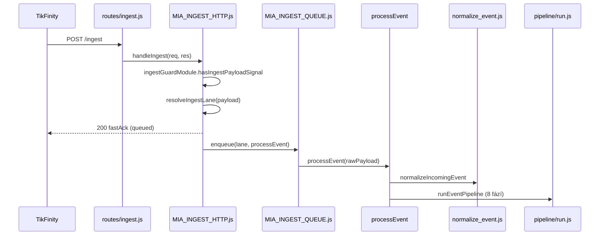
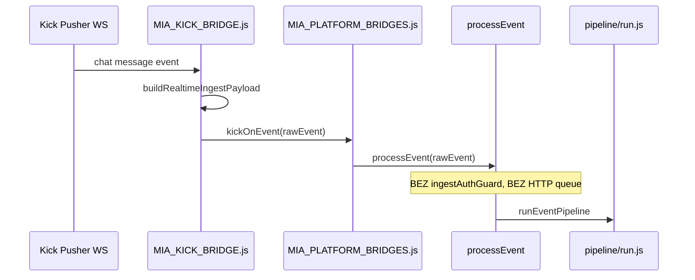

# Flow: Ingest — TikFinity + Kick chat

> Etapa 2 — end-to-end trace chat událostí  
> Ověřeno proti: `routes/ingest.js`, `scripts/MIA_INGEST_HTTP.js`, `scripts/MIA_KICK_BRIDGE.js`, `scripts/pipeline/`

---

## Vstup

### TikFinity / TikTok LIVE (primární)

| Parametr | Hodnota |
|----------|---------|
| Protokol | HTTP `POST /ingest` nebo `GET /ingest` |
| Route | `routes/ingest.js` → `handleIngest` |
| Auth | `ingestAuthGuard` (`MIA_INGEST_SECRET` pokud nastaveno) |
| Payload | TikFinity webhook JSON (comment, like, follow, share, gift) |

### Kick chat (default ON)

| Parametr | Hodnota |
|----------|---------|
| Protokol | Pusher WebSocket (`MIA_KICK_BRIDGE.js`) |
| Alternativa | `POST /kick/webhook` pokud `MIA_KICK_MODE=webhook` |
| Config | `MIA_KICK_ENABLED=1` (default), `KICK_CHANNEL`, `MIA_KICK_CHATROOM_ID` |
| Ingress | **Přímo** `processEvent()` — ne HTTP `/ingest` |

### Debug / simulace

| Parametr | Hodnota |
|----------|---------|
| Route | `routes/debug.js` (vyžaduje `MIA_DEBUG_ROUTES=on`) |
| Handler | `handleDebugComment` → `processEvent` |

---

## Zpracování (soubory/moduly v pořadí)

### Cesta A — TikFinity HTTP



**Soubory:**

1. `routes/ingest.js` — registrace endpointů
2. `scripts/MIA_INGEST_HTTP.js` — `handleIngest`, `normalizeIncomingEvent`
3. `scripts/MIA_INGEST_QUEUE.js` — lane queue (`support` vs `community`), paralelismus community
4. `scripts/MIA_INGEST_LANE.js` — `resolveIngestLane`, `resolveLaneFromNormalized`
5. `shared/platform_normalizers/normalize_event.js` — `normalizeEvent(raw, { runtimeConfig })`
6. `scripts/MIA_EVENT_CONTEXT.js` — sestavení `ctx`
7. `scripts/pipeline/run.js` — 8 fází

### Cesta B — Kick realtime



**Soubory:**

1. `scripts/MIA_KICK_BRIDGE.js` — WS connect, dedupe map, `postToIngest` (webhook mode)
2. `scripts/MIA_PLATFORM_BRIDGES.js` — `kickOnEvent` → `processEvent` + log
3. `index.js` — `bootstrapPlatformBridges()` při startu serveru

### Normalizace chat eventu

`shared/platform_normalizers/normalize_event.js`:

- Detekce platformy: `detectPlatform()` — tiktok/kick/twitch
- Explicitní `type`/`eventType` z query/body má přednost
- Výstup pro chat: `{ eventType: "COMMENT", route: "community", platform, message, user: {...} }`
- Jazyk: `scripts/MIA_LANGUAGE.js` → `attachLanguageToEvent` (pokud COMMENT)

Fallback (pokud normalizer chybí): `scripts/MIA_INGEST_HTTP.js` → `normalizeIncomingEvent` fallback větev.

### Pipeline fáze relevantní pro chat

| Fáze | Soubor | Chat-specifické |
|------|--------|-----------------|
| session | `phase_session.js` | dedupe, ingest log, stream session PRELIVE→LIVE |
| observe | `phase_observe.js` | `pushChatFeed`, chat lexicon, session memory, mood brain, solo stream reset |
| enrich | `phase_enrich.js` | `viewerMemory.recordChat`, director plan, runtime state |
| command_gate | `phase_command_gate.js` | chat commands (!care, !duel, …) — NEOVĚŘENO detail handler mapy |
| decide | `phase_decide.js` | `shadowRuntime.runShadowPipeline` → direct chat action |
| present | `phase_present.js` | LLM enhance (`MIA_RESPONSE_ENGINE`), translation, **deliverActionVoice** |
| execute | `phase_execute.js` | overlay emit přes execution bridge |
| post | `phase_post.js` | commit state, post-hooks |

---

## Rozhodování

**Decision engine (chat):** `MIA_NEXT/engine_shadow_runtime.js`

```
normalized COMMENT
  → decision_engine (shared/platform_runtime_rules/decision_engine.js)
  → action_builder (shared/platform_runtime/action_builder.js)
  → actionResult { overlayPayload, voicePlan, reason, ... }
```

Typické důvody (ověřeno v shadow runtime + testech):

- Direct chat mention MIA → community overlay + TTS
- Illness/contagion dual voice scénáře → Koj vitals side effect
- Spam session (support lane) — pro chat méně relevantní

**Action Queue:** default OFF — chat neprochází AQ unless `MIA_ACTION_QUEUE=1`.

---

## Výstup (OBS / overlay / TTS)

| Výstup | Mechanismus |
|--------|-------------|
| Text overlay | `deliverActionVoice` → `maybeDeliverMiaVoice` → `executeOverlay` → `overlayState.miaOverlay` |
| OBS browser | Browser source polluje `GET /overlay-state` (`routes/overlay.js`) |
| TTS audio | `scripts/MIA_TTS_ENGINE.js` (Edge default) → audio URL → `voicePlaybackState` → OBS `MIA_VOICE` source |
| Chat feed | `pushChatFeed` → `overlayState.chatFeed[]` (max items dle config) |
| Lip sync | `mia-output-overlay/lib/mia-live-lip.js` — čte voice playback z overlay-state |

---

## Stav (kde se ukládá)

| Data | Úložiště |
|------|----------|
| Chat feed (overlay) | In-memory `overlayState.chatFeed` |
| Session memory | `data/mia-session-memory.json` + in-memory |
| Viewer memory (chat stats) | `data/viewer-memory.json` |
| Chat lexicon | `data/mia-chat-lexicon.json` |
| Stream session | In-memory + `MIA_STREAM_SESSION` modul |
| Ingest dedupe | In-memory deduper v pipeline deps |

---

## Slabá místa (pouze pozorování)

1. **Dva ingressy, různá ochrana:** Kick bridge volá `processEvent` přímo — ne `ingestAuthGuard`, ne HTTP queue lane throttling.
2. **FastAck vs sync:** TikFinity dostane 200 dřív než pipeline doběhne — chyby jsou jen v logu (`ingest_async`).
3. **Kick chatroom fallback:** při selhání API resolve → default `chatroomId=95746130` (hardcoded fallback v bridge).
4. **Dedupe:** Kick bridge má vlastní `dedupe Map`; HTTP ingest má pipeline deduper — ne sdílený.

---

## NEOVĚŘENO

- Kompletní mapa chat command handlerů v `phase_command_gate.js` / `MIA_COMMAND_REGISTRY.js`
- Live chování Kick Pusher reconnect při dlouhém streamu (kód existuje, verify za běhu ne)
- Twitch chat path (`MIA_TWITCH_ENABLED=1`) — kód v `MIA_TWITCH_BRIDGE.js`, default OFF
