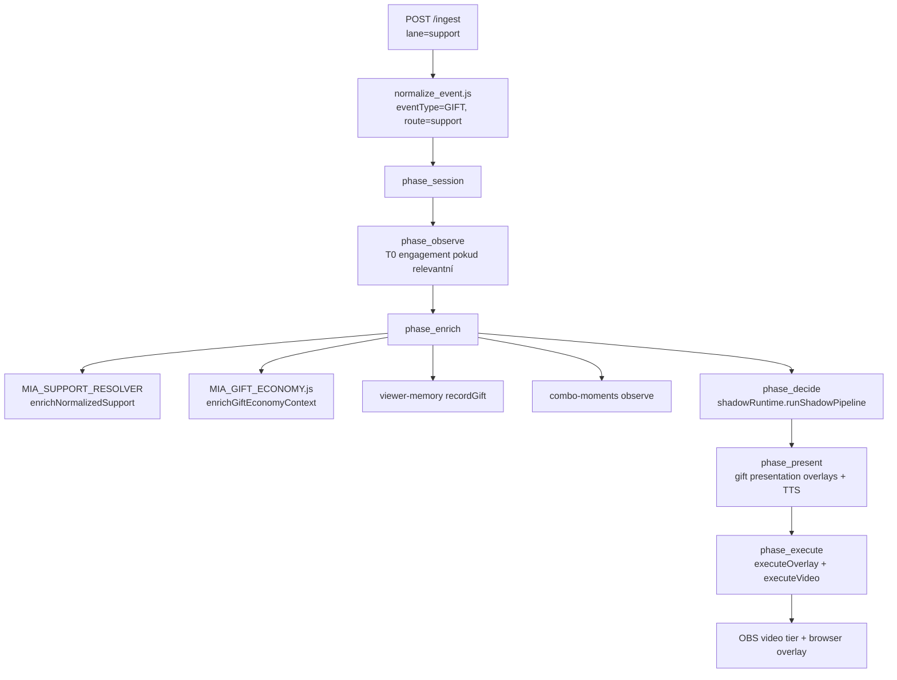

# Flow: Gifts — ingest → economy → video → overlay

> Etapa 2 — gift/support pipeline  
> Pravidlo: overlay **nikdy** neexpozuje coins — jen `miaPoints` (`MIA_OVERLAY_PUBLIC_RESPONSE.js`)

---

## Vstup

| Zdroj | Endpoint / bridge | Typ eventu |
|-------|-------------------|------------|
| TikFinity | `POST /ingest` | `GIFT` / support lane |
| Debug | `routes/debug.js` `handleDebugGift` | simulovaný gift |
| Admin | admin simulate routes | NEOVĚŘENO — detail admin gift inject |

Typický TikFinity payload: `{ giftName, coins, repeatCount, uniqueId, nickname, ... }`

---

## Zpracování (soubory/moduly v pořadí)



### 1. Normalizace

**Soubor:** `shared/platform_normalizers/normalize_event.js`

- Detekce gift: `giftName`, `coins`, `repeatCount`, explicitní type
- **Neurčuje finální tier** — komentář v kódu: tier = source-of-truth v support resolveru
- Platforma: tiktok (TikFinity) default

### 2. Enrich — economy & mapping

**Soubory:**

| Modul | Role |
|-------|------|
| `scripts/MIA_SUPPORT_RESOLVER.js` (legacy) / resolver v pipeline | Gift key, category, care, obsTier |
| `shared/gifts` (`giftMapEnterprise`) | Kanonická gift mapa |
| `scripts/MIA_GIFT_ECONOMY.js` | XP, levely, combo, streak, boss event metadata |
| `scripts/MIA_GIFT_TIERS.js` | `MIA_POINTS_PER_COIN` (default 7.5), coin tier thresholds |
| `core/event-normalizer.js` | `coinsToMiaPoints()`, `miaRuntimeEvent` shape |
| `scripts/MIA_GIFT_USER_LEDGER.js` | Recent gift users pro overlay |

**Konverze coins → miaPoints:**

```javascript
// core/event-normalizer.js
coinsToMiaPoints(coins, count) = coins * count * MIA_POINTS_PER_COIN
```

Tier prahy: `MIA_GIFT_ECONOMY_TIERS=coins` (default) nebo `legacy` — env v `.env.example`.

### 3. Rozhodování (Decision Engine)

**Soubor:** `MIA_NEXT/engine_shadow_runtime.js`

Flow pro GIFT:

1. Optional spam session (`MIA_NEXT/engine_spam_session.js`) — agregace rapid gifts
2. `decision_engine` — tier T1–T4, shouldPlayVideo, overlay owner (mia/koj)
3. `action_builder` — sestaví `actionResult` s `overlayPayload`, `shouldPlayVideo`, `tier`
4. `MIA_SUPPORT_REACTION_POLICY.js` — reakční policy
5. `prepareGiftEconomyPresentation` v `phase_decide` — attach `giftPresentationPlan`

Spam reward: capnutý na T3 (kód v shadow runtime).

### 4. Prezentace (phase_present)

**Soubory:**

| Modul | Role |
|-------|------|
| `scripts/MIA_PRESENTATION_PLAN.js` | Presentation plan builder |
| `scripts/MIA_GIFT_PRESENTATION.js` | Gift overlay cues |
| `scripts/MIA_GIFT_VISUAL_COMPOSER.js` | Visual compose scheduling |
| `scripts/MIA_STORY_ANIMATION_ENGINE.js` | Storyboard animace (Lion/Universe/…) |
| `scripts/MIA_SPEAKER_ROUTING.js` | Kdo mluví, defer voice pro video |
| `scripts/MIA_DELIVERY_RUNTIME.js` | `executeGiftPresentationOverlays`, `deliverActionVoice` |

Gift video plán: `attachGiftVideoPlan` → tier video pick z `MIA_VIDEO_ENGINE.js`.

### 5. Exekuce (phase_execute)

**Soubor:** `shared/runtime_execution/run_runtime_execution_bridge.js`

Pořadí:

1. Primary overlay emit (`executeOverlay`)
2. Companion overlay (Koj) pokud v actionResult
3. Deferred Koj companion (`setTimeout`, delay ~3200 ms)
4. Gift video (`executeVideo`) pokud `shouldPlayVideo`

**Video engine:** `scripts/MIA_VIDEO_ENGINE.js`

- Per-tier rotation: `rotationIndexByTier` (kánon — bez resetu tier indexu)
- OBS WS: scene switch, media source enable, restore scene
- Bowl-full special sources z config

**Koj bowl impact:** `KOJNOZROUT_BOWL_ENGINE.js` — bowl fill před/po gift impact (předáváno jako `bowlBeforeImpact`).

---

## Rozhodování — klíčové větve

| Podmínka | Výsledek |
|----------|----------|
| Tier T1–T2 | Menší overlay, optional video |
| Tier T3–T4 | Video + výraznější overlay, boss cinematic možný |
| Spam session milestone | Video jen při `newlyConfirmed` reward |
| Bowl 100% | `shouldTriggerFullBowl` → special video/overlay moment |
| Action Queue ON | Combo moment může enqueue místo immediate execute |

---

## Výstup (OBS / overlay / TTS)

| Kanál | Obsah | Coins? |
|-------|-------|--------|
| `GET /overlay-state` → `miaOverlay` / `kojnozoutOverlay` | text, tier, miaPoints, giftName | **NE** — strip v `MIA_OVERLAY_PUBLIC_RESPONSE.js` |
| OBS browser sources | `mia-live-hub.html`, split overlays | NE |
| OBS media sources | T1–T5 tier videos | NE (video only) |
| TTS (`MIA_VOICE`) | thank-you / reaction speech | NE |
| Gift animation overlay | `shared/mia-gift-animation` via `routes/gift_animation.js` | NE |

---

## Stav (kde se ukládá)

| Data | Úložiště |
|------|----------|
| Bowl percent / vitals | `kojnozoutState` → persist `data/kojnozout-state.json` |
| Gift user ledger | In-memory v pipeline runtime |
| Viewer memory / levels | `data/viewer-memory.json` |
| Gift map stats | `data/gift-map-stats.json` |
| Last gift mapping | In-memory `lastGiftMapping` v index.js |
| Video rotation index | In-memory ve video engine — NEOVĚŘENO persist |
| Runtime state snapshot | `data/runtime-state.json` (phase_enrich commit) |

---

## Slabá místa (pouze pozorování)

1. **Coins v internal event, ne na overlay:** sanitizace je na HTTP hranici — interní logy (`gift-mapping` log) stále obsahují `totalCoins`.
2. **Dvojí tier systém:** stream tier (coins) vs legacy miaPoints prahy — env `MIA_GIFT_ECONOMY_TIERS` musí být konzistentní.
3. **Gift video + voice timing:** defer MIA voice pro video (`shouldDeferVoiceForGiftVideo`) — složitá interakce OBS audio.
4. **Monolitní gift presentation chain:** 10+ modulů v present/execute fázi.

---

## NEOVĚŘENO

- `shared/mia-economy-core/economyEngine.js` — zda je volán v live gift path nebo jen v testech/canon stubs
- Persist video `rotationIndexByTier` across restart
- Admin gift simulation exact route path
