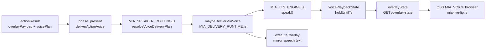

# Flow: MIA speech / body / holo overlays + TTS

> Etapa 2 — MIA avatar výstupy (ne Koj)  
> Scope: overlay text, body rig, holo motion, TTS delivery

---

## Vstup

| Zdroj | Trigger |
|-------|---------|
| Chat direct reply | `actionResult` z shadow runtime po COMMENT |
| Gift thank-you | `actionResult` po GIFT (MIA speaker) |
| Proactive host | `scripts/MIA_PROACTIVE_HOST.js` — solo stream / quiet chat |
| Admin test | `GET /tts/test`, `GET /ping-overlay` |
| Showcase | `routes/koj.js` `/showcase/*` — MIA lines NEOVĚŘENO |

---

## Zpracování (soubory/moduly v pořadí)



### 1. Voice plán

**Soubor:** `scripts/MIA_SPEAKER_ROUTING.js`

- `resolveVoiceDeliveryPlan(actionResult)` → `{ shouldSpeak, voiceSpeaker, voiceMode, text }`
- `applyVoiceOverlayPolicy` — synchronizace overlay text s TTS
- `shouldDeferVoiceForGiftVideo` — odložení MIA hlasu po gift video
- Dual owner routing: MIA vs Kojnožrout

### 2. TTS engine

**Soubor:** `scripts/MIA_TTS_ENGINE.js`

| Parametr | Default |
|----------|---------|
| Enabled | `MIA_TTS_ENABLED` — true (nebo unset = on) |
| Provider | Edge (`edge-tts-universal`) pokud není OpenAI key |
| MIA voice | `MIA_TTS_EDGE_VOICE=cs-CZ-VlastaNeural` |
| Koj voice | `MIA_TTS_EDGE_VOICE_KOJ=cs-CZ-AntoninNeural` |
| Cache | filesystem cache dir |

Výstup: `{ ok, audioUrl, durationMs, speaker }`

### 3. Voice delivery runtime

**Soubor:** `scripts/MIA_DELIVERY_RUNTIME.js`

Klíčové funkce:

- `deliverActionVoice(actionResult)` — entry z `phase_present`
- `maybeDeliverMiaVoice(actionResult, voicePlan)` — queue + speak + overlay mirror
- `mirrorSpeechOverlayFromVoice` — text na overlay během mluvení
- `voiceSpeakQueue` — serializace TTS požadavků
- `scheduleDeferredMiaVoice` — pro gift video defer

**Dual voice flag:**

```javascript
// shared/runtime_execution/run_runtime_execution_bridge.js
const dualVoiceOn = String(process.env.MIA_DUAL_VOICE || "").trim() === "1";
// OFF (default): deferred Koj = overlay only
// ON: deferred Koj může mít i TTS
```

### 4. Overlay emit

**Soubor:** `scripts/MIA_OVERLAY_STATE.js`

- `setOverlay(payload, { force, holdMs, priority })`
- Normalizace owner: `mia` | `kojnozout`
- Priority: support=5, community=3
- Hold: min 8500–12000 ms dle route

**HTTP:** `routes/overlay.js`

- `GET /overlay-state` — public snapshot (cache 450 ms default)
- `GET /ping-overlay` — test overlay

### 5. MIA body / holo (browser-side)

**Adresář:** `mia-output-overlay/`

| Modul | Role |
|-------|------|
| `lib/mia-body-part-runtime.js` | Body part animace |
| `lib/mia-holo-motion.js` | Holo efekty |
| `lib/mia-live-lip.js` | Lip sync k TTS audio |
| `lib/mia-live-presence.js` | Presence indikátor |
| `lib/mia-part-rig.js` | Part rig |
| `lib/mia-rig-anchors.js` | Anchor body |
| `lib/mia-tech-energy.js` | Tech energy vizuál |
| `assets/mia-2d-fx.js` | 2D FX |
| `assets/mia-animation-player.js` | Animation player |

Browser sources načítají stav z `/overlay-state` polling (`lib/overlay-poll.js`).

**OBS integrace:**

- Browser source URL typicky `http://127.0.0.1:3000/mia-live-hub.html`
- `MIA_VOICE` — audio output pro stream (`MIA_OBS_VOICE_ANTI_ECHO=1` default)
- `scripts/MIA_EYES.js` — eye tracking overlay (`routes/eyes.js`)

---

## Rozhodování

| Podmínka | Chování |
|----------|---------|
| `voicePlan.shouldSpeak === false` | Jen overlay text, bez TTS |
| Koj primary speaker | MIA voice může být secondary / deferred |
| Gift video active | MIA voice deferred (`miaVoiceDeferredForVideo`) |
| `MIA_DUAL_VOICE=0` | Koj deferred companion bez TTS |
| TTS disabled | Overlay může jít, audio skipped |
| Voice hold active | Nový TTS čeká ve frontě |

---

## Výstup

| Výstup | Cíl |
|--------|-----|
| Text overlay | OBS browser — `overlayState.miaOverlay` |
| Audio | OBS `MIA_VOICE` browser / media source |
| Lip sync | `mia-live-lip.js` ← `voicePlaybackState` v overlay-state |
| Body motion | Client-side runtime dle mood/presence flags v snapshot |
| Holo FX | Client-side dle overlay payload meta |

---

## Stav

| Data | Úložiště |
|------|----------|
| Active overlay | In-memory `overlayState.miaOverlay` |
| Voice playback | In-memory `voicePlaybackState` + seq counter |
| Output state (proactive) | In-memory `outputState` |
| TTS cache files | filesystem (cache dir z config) |
| Session bot replies | `MIA_SESSION_MEMORY.js` |

---

## Slabá místa (pouze pozorování)

1. **TTS v present fázi, video v execute:** hlas může začít před video enqueue — defer logika kompenzuje, ale je křehká.
2. **Edge TTS bez garantované latence:** `estimateDurationMs` heuristic — lip sync approximace.
3. **Voice queue in-memory:** restart serveru = ztráta fronty.
4. **Body/holo moduly:** mnoho označeno v inventuře jako `pravděpodobně_ne` pro server-side require — primárně client-side v browser overlay.

---

## NEOVĚŘENO

- Které body-part moduly jsou aktivní v produkčním `mia-live-hub.html` vs preview-only
- OpenAI TTS provider path za běhu (default Edge)
- Přesný mapping OBS source names → overlay HTML files across all scenes
