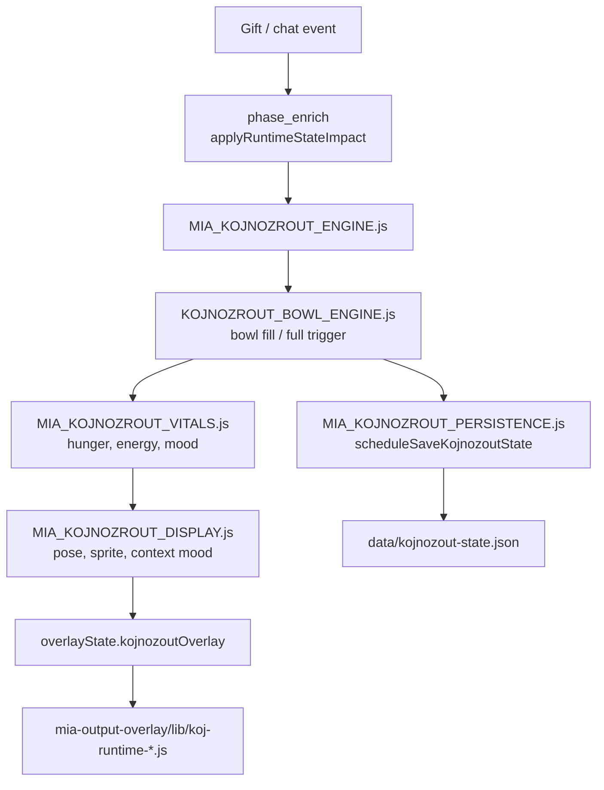

# Flow: Kojnožrout + bowl + display/runtime

> Etapa 2 — Koj creature loop (feed, bowl, vitals, display)

---

## Vstup

| Zdroj | Typ |
|-------|-----|
| Gift (support lane) | Bowl fill, feed behavior, mood shift |
| Chat / care commands | Vitals, illness, care quest |
| Admin API | `routes/koj.js` — wake, test-mode, snapshot |
| World/duel | `MIA_KOJNOZROUT_DUEL.js`, arena sync |
| Decay tick | Runtime loops — NEOVĚŘENO interval |

---

## Zpracování (soubory/moduly v pořadí)

### Core engine moduly

| Modul | Role |
|-------|------|
| `scripts/MIA_KOJNOZROUT_ENGINE.js` | Hlavní stav Koj, snapshot builder |
| `scripts/KOJNOZROUT_BOWL_ENGINE.js` | Bowl percent 0–100, full bowl trigger, cooldown |
| `scripts/MIA_KOJNOZROUT_VITALS.js` | Hunger, energy, sleep, illness, sync |
| `scripts/MIA_KOJNOZROUT_EVOLUTION.js` | Evolution tier, stage transitions |
| `scripts/MIA_KOJNOZROUT_DISPLAY.js` | Pose pools, mood→sprite, feed pulse, ambient motion |
| `scripts/MIA_KOJNOZROUT_ASSETS.js` | Sprite URLs, evolution tier assets |
| `scripts/MIA_KOJNOZROUT_WALK.js` | Viewer walk moment (`MIA_KOJ_WALK_DURATION_MS`) |
| `scripts/MIA_BOWL_FULL_VIDEO.js` | Special video při full bowl |

### Bowl logika

**Soubor:** `scripts/KOJNOZROUT_BOWL_ENGINE.js`

- `bowlPercent` / `bowlState` / `bowlFillPercent` — sync compat fields
- `shouldTriggerFullBowl(state)` — percent ≥ 100, not already triggered, not in cooldown
- `markFullTriggered` — cooldown guard (`POST_RESET_GUARD_MS`)
- Full bowl → trigger pro video engine / special OBS sources (`bowlFullSpecialSources` v config)

### Display / runtime (browser)

**Adresář:** `mia-output-overlay/lib/`

| Modul | Role |
|-------|------|
| `koj-runtime-scene.js` | Scene composition |
| `koj-runtime-stage.js` | Stage layout |
| `koj-runtime-pose.js` | Pose transitions |
| `koj-runtime-sprite.js` | Sprite rendering |
| `koj-runtime-belly.js` | Belly/bowl visual |
| `koj-runtime-fx.js` | FX layer |
| `koj-runtime-walk.js` | Walk animation |
| `koj-live-motion.js` | Live motion |
| `koj-body-anchors.js` | Anchor points |
| `assets/kojnozout/pose-catalog.js` | Pose katalog (918 řádků) |

Polling: `lib/overlay-poll.js` → `/overlay-state` → `kojnozout` sekce snapshotu.

### Care & bond (satellite)

| Modul | Role |
|-------|------|
| `MIA_KOJNOZROUT_CARE.js` | Care actions |
| `MIA_KOJNOZROUT_CARE_QUEST.js` | Quest progress |
| `MIA_KOJNOZROUT_BOND.js` | Bond level |
| `MIA_KOJNOZROUT_BACKPACK.js` | Items |
| `routes/care_commands.js` | HTTP care endpoints |

### HTTP routes

**Soubor:** `routes/koj.js`

- `GET /koj/snapshot` — public Koj state (admin guard)
- `POST /koj/wake` — wake from sleep
- `POST /koj/test-mode` — test mode toggle
- `POST /showcase/start` — streamer showcase

Public snapshot sanitizace: `getPublicKojSnapshot()` — stejný coin strip jako overlay.

---

## Rozhodování

| Podmínka | Efekt |
|----------|-------|
| Gift support | Bowl += impact z gift economy; mood → excited/happy |
| Bowl 100% | Full bowl event → special video moment |
| Illness chat (COMMUNITY_ILLNESS_DUAL) | `applyIllnessContagion` v phase_present |
| Sleeping (`isSleeping`) | Display:blocked context moods |
| Combo moment `bowl_rush` | Director + optional AQ enqueue |
| Test mode ON | Override vitals behavior |

Koj overlay owner v gift flow: `actionResult.companionOverlayPayload` nebo deferred companion.

---

## Výstup

| Výstup | Mechanismus |
|--------|-------------|
| Koj text overlay | `overlayState.kojnozoutOverlay` |
| Koj TTS | Edge voice Antonín — pokud speaker=kojnozout a not deferred-only |
| Bowl visual | Browser `koj-runtime-belly.js` ← `bowlPercent` ve snapshot |
| Pose/sprite | `MIA_KOJNOZROUT_DISPLAY.resolveDisplaySnapshot` |
| Full bowl video | `MIA_VIDEO_ENGINE` + `MIA_BOWL_FULL_VIDEO` |
| OBS scene | `KOJNOZROUT_SCENE` etc. z `MIA_CONFIG` overlay scene map |

---

## Stav

| Data | Soubor / paměť |
|------|----------------|
| Koj core state | In-memory `kojnozoutState` |
| Persist | `data/kojnozout-state.json` — fields: bowlPercent, hunger, mood, vitals, bond, … |
| World/duel | `data/kojnozout-world.json` |
| Long-term needs | fatigue, techCharge — `core/koj-long-term-needs.js` |
| Runtime snapshot | `data/runtime-state.json` (koj ref) |

**Poznámka:** persist obsahuje `totalFedCoins` interně — **není** v public overlay snapshot.

---

## Slabá místa (pouze pozorování)

1. **Mnoho compat polí:** `bowlPercent`, `bowlState`, `bowlFillPercent`, `bowl.percent` — riziko desync.
2. **Client-side runtime rozsáhlý:** 7+ koj-runtime modulů — server posílá snapshot, klient interpretuje.
3. **Persist async:** `scheduleSaveKojnozoutState` — crash před flush = ztráta posledních změn.
4. **pose-catalog.js 918 řádků** — inventura: server-side `pravděpodobně_ne`, ale klient ho může načítat přímo.

---

## NEOVĚŘENO

- Přesný decay tick interval a wiring v `MIA_RUNTIME_LOOPS.js`
- Live propojení `koj-vector.js` vs sprite runtime
- Duel overlay choreo (`MIA_KOJ_BATTLE_CHOREOGRAPHY.js`) — trigger conditions za běhu
