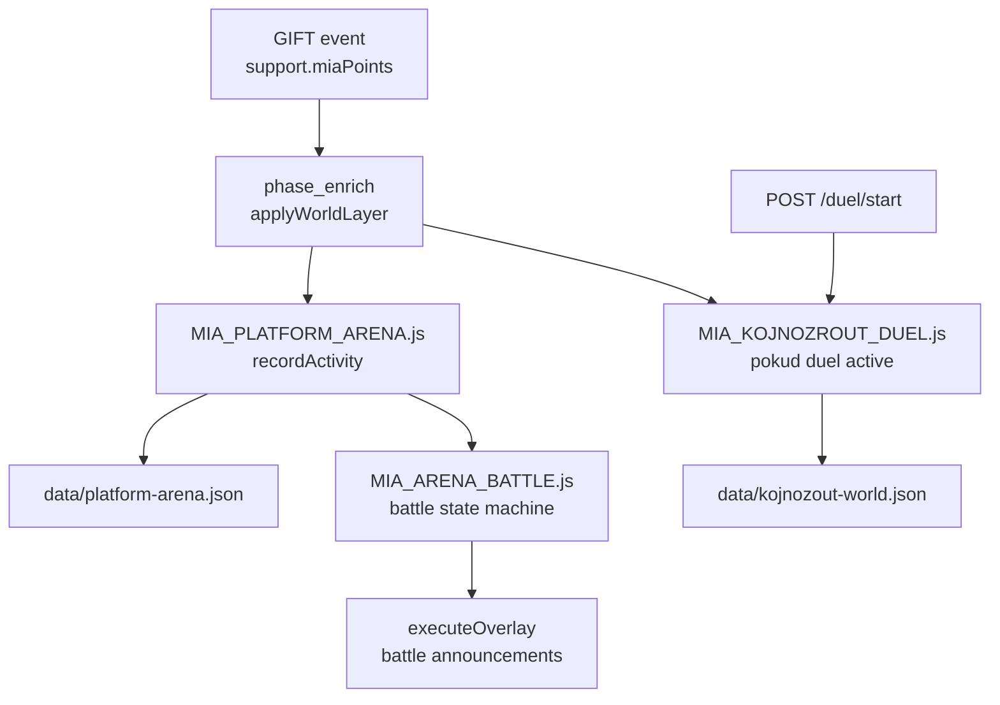

# Flow: Battle / arena + economy / points

> Etapa 2 — soubojové a ekonomické vrstvy (miaPoints)

---

## Vstup

| Zdroj | Event / endpoint |
|-------|------------------|
| Gift ingest | miaPoints z support resolver → arena activity |
| Chat / likes | Arena activity points (weighted) |
| Admin duel | `POST /duel/start`, `/duel/opponent-sync` |
| Platform arena | `routes/arena.js` — battle MVP routes |
| World layer | `phase_enrich` → `applyWorldLayer` |

---

## Zpracování (soubory/moduly v pořadí)

### Platform Arena

**Soubor:** `scripts/MIA_PLATFORM_ARENA.js`

- State path: `data/platform-arena.json`
- User rows: `{ miaPoints, platform, activity... }`
- `resolveActivityPoints(eventType, miaPoints)` — váhy pro gift/chat/like
- `pushBattleAction` → `MIA_ARENA_BATTLE.js`
- Battle steal mechanics: odebere miaPoints protivníkovi

**Soubor:** `scripts/MIA_ARENA_BATTLE.js`

- State machine: announce → countdown → active (default MVP ON)
- Legacy instant: `MIA_BATTLE_MVP=0` — env override

### Koj Duel (peer sync)

**Soubory:**

| Modul | Role |
|-------|------|
| `scripts/MIA_KOJNOZROUT_DUEL.js` | Local duel state, opponent sync |
| `scripts/MIA_KOJNOZROUT_DUEL_BRIDGE.js` | Bridge ingest → duel points |
| `scripts/MIA_KOJNOZROUT_WORLD_PERSISTENCE.js` | World save |

**Routes:** `routes/arena.js`

- `POST /duel/start` — start duel (admin guard)
- `GET /duel/export` — export local side pro peer
- `POST /duel/opponent-sync` — sync opponent state
- `POST /duel/opponent-points` — push opponent points
- Arena battle demo routes — NEOVĚŘENO detail

### Gift Economy (body)

**Soubor:** `scripts/MIA_GIFT_ECONOMY.js`

- XP / gift levels z cumulative support
- Combo thresholds (10/50/100)
- Streak bonus (3/7/30 days)
- Boss events by tier (T4/T5/T6)
- **Interně pracuje s coins** → převod na miaPoints přes tiers

**Soubor:** `core/viewer-memory.js`

- `levelFromMiaPoints` — viewer levels veřejně
- Persist: `data/viewer-memory.json`

**Shared canon stubs (NEOVĚŘENO live wiring):**

- `shared/mia-economy-core/economyEngine.js`
- `shared/mia-progression-core/progressionEngine.js`
- `shared/mia-achievement-core/achievementEngine.js`

### Host team split

**Soubor:** `scripts/MIA_HOST_TEAM_POINTS.js`

- `MIA_HOST_TEAM_SPLIT_PCT=50` — split v host modu
- NEOVĚŘENO — přesný trigger v pipeline

---

## Rozhodování

| Podmínka | Výsledek |
|----------|----------|
| `phase3.battleMvp.enabled: true` | Battle state machine (default) |
| Duel active + peerUrl | Cross-stream sync enabled |
| Gift tier ≥ T3 | Boss cinematic možný (`MIA_BOSS_MISSION.js`) |
| Arena battle action | Point steal / platform competition |
| Action Queue ON + battle priority | Priority 85 v AQ — pokud full routing |

Body na overlay: **jen miaPoints** — arena leaderboard v public snapshot prochází sanitizací.

---

## Výstup

| Výstup | Cíl |
|--------|-----|
| Battle overlay | `executeOverlay` — announce/countdown/result |
| Arena leaderboard | `/overlay-state` arena section |
| Boss cinematic | `mia-output-overlay/assets/boss-cinematic-ui.js` |
| Duel overlay | Split overlays (`MIA_SPLIT_OVERLAYS`) |
| OBS battle scene | `MIA_BATTLE_SCENE` / `KOJNOZROUT_BATTLE_SCENE` z config |

---

## Stav

| Data | Soubor |
|------|--------|
| Platform arena | `data/platform-arena.json` |
| Koj world + duel | `data/kojnozout-world.json` |
| Viewer memory/levels | `data/viewer-memory.json` |
| Viewer inventory | `data/viewer-inventory.json` |
| Gift economy runtime | In-memory v pipeline + supporter profile |

---

## Slabá místa (pouze pozorování)

1. **Více battle systémů:** Platform arena, Koj duel, boss mission, arena battle demo — hranice ne vždy explicitní.
2. **Peer duel sync:** HTTP POST bez auth na `/duel/opponent-sync` — NEOVĚŘENO zabezpečení.
3. **Shared economy cores:** paralelní canon moduly vs live `MIA_GIFT_ECONOMY.js` — duplicita konceptu.
4. **Battle overlay timing vs video queue:** stejné riziko kolizí jako u gift flow.

---

## NEOVĚŘENO

- Live použití `shared/mia-economy-core` v ingest path
- `MIA_PLATFORM_ARENA` — které event typy kromě GIFT skutečně inkrementují body za běhu
- Arena battle demo routes — produkční vs dev-only
