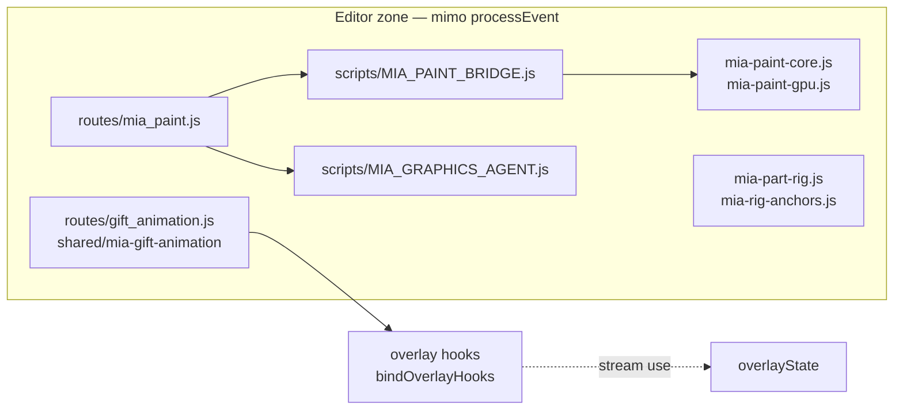

# Flow: Editor / graphics studio (mimo stream core)

> Etapa 2 — paint, rig, gift desks, graphics studio  
> **Poznámka:** tyto subsystémy nejsou součástí live ingest pipeline

---

## Vstup

| Zdroj | Endpoint |
|-------|----------|
| Admin / local dev | `routes/mia_paint.js` |
| WebSocket | `scripts/MIA_PAINT_WS.js` |
| Gift animation desk | `routes/gift_animation.js` |
| Remote dev | `routes/remote_dev.js` |
| Browser UI | `/mia-paint/`, graphics studio HTML |

---

## Zpracování (soubory/moduly v pořadí)



### MIA Paint (graphics studio)

**Routes:** `routes/mia_paint.js`

| Endpoint | Role |
|----------|------|
| `GET /mia-paint` | Redirect na editor |
| `GET /mia/paint/status` | Public status |
| `POST /mia/paint/connect` | Client connect |
| `POST /mia/paint/sync` | Client → server sync |
| `POST /mia/paint/command` | Run editor command |
| `POST /mia/paint/autosave` | Autosave |
| Agent routes | `MIA_GRAPHICS_AGENT.js` — AI assist NEOVĚŘENO detail |

**Core moduly:**

| Cesta | Role |
|-------|------|
| `scripts/MIA_PAINT_BRIDGE.js` | Server-side bridge |
| `scripts/MIA_PAINT_WS.js` | WebSocket broadcast |
| `scripts/MIA_PAINT_PLUGIN_LOADER.js` | Plugin loading |
| `scripts/MIA_PAINT_NATIVE_BRIDGE.js` | Native bridge |
| `scripts/MIA_PAINT_AI.js` | AI bridge |
| `mia-output-overlay/mia-paint/app.js` | Browser editor (2485 ř.) |
| `mia-output-overlay/mia-paint/lib/mia-paint-core.js` | Core logic (3033 ř.) |
| `mia-output-overlay/mia-paint/lib/mia-paint-gpu.js` | GPU path |
| `mia-output-overlay/mia-paint/lib/mia-graphics-client.js` | Client API |

**Registrace:** `routes/index.js` — optional try/catch require.

### Rig / body part tools

**Adresář:** `mia-output-overlay/lib/`

| Modul | Role |
|-------|------|
| `mia-part-rig.js` | Part rigging |
| `mia-rig-anchors.js` | Anchor editor |
| `mia-body-part-runtime.js` | Runtime preview |
| `mia-graphics-preview.js` | Preview shell |

Inventura Krok -1: většina **pravděpodobně_ne** pro server require — editor/client tooling.

### Gift animation desk

**Route:** `routes/gift_animation.js`  
**Engine:** `shared/mia-gift-animation`

- `bindOverlayHooks` — propojení na live overlay state pro preview/generate
- `ensureGiftAnimationObsVisible` — OBS source `MIA_GIFT_ANIMATION`
- Admin generate/ask-words endpoints

**Hranice se stream core:** gift animation může emitovat do `overlayState` přes hooks, ale **negeneruje se automaticky z ingest pipeline**.

### Remote dev / fold

| Route | Role |
|-------|------|
| `routes/remote_dev.js` | Remote development helpers |
| `routes/remote_fold.js` | Remote fold UI |

NEOVĚŘENO — produkční použití.

### Shared graphics studio

**Adresář:** `shared/mia-graphics-studio/`

- `moodBrain.js` — použit i v runtime (`MIA_KOJNOZROUT_DISPLAY.js` import)
- Contract testy existují — live vs editor usage mixed

---

## Rozhodování

Editor subsystémy **nemají decision engine** — příkazy jdou:

```
HTTP/WS → MIA_PAINT_BRIDGE.runCommand → mia-paint-core → (optional) GPU/AI
```

Výstup do streamu jen pokud explicitně:

- admin publish/sync
- gift animation generate + overlay hook
- anchor export → `mia-output-overlay/anchors/` (served by overlay routes)

---

## Výstup

| Výstup | Cíl |
|--------|-----|
| Editor UI | Browser `/mia-paint/` |
| Exported assets | filesystem / anchors dir |
| Gift animation preview | OBS `MIA_GIFT_ANIMATION` source |
| WS status | Connected paint clients |

**Nepřímý vliv na stream:** publikované assety může načítat live overlay runtime.

---

## Stav

| Data | Úložiště |
|------|----------|
| Paint project state | Bridge in-memory + autosave — NEOVĚŘENO path |
| Anchor files | `mia-output-overlay/anchors/` |
| Plugin state | `plugins/mia-paint/` static |
| Gift animation jobs | In-memory v gift animation modul |

---

## Slabá místa (pouze pozorování)

1. **Obří client soubory:** `mia-paint-core.js` 3033 ř., `app.js` 2485 ř. — mimo stream core, ale v repu.
2. **Optional route registrace:** try/catch v `routes/index.js` — silent skip pokud chybí deps.
3. **Overlay hook z editoru:** gift animation může zapisovat do live `overlayState` — potenciální interference s live streamem pokud admin omylem.
4. **Inventura:** většina EDITOR/OVERLAY modulů `pravděpodobně_ne` pro server graph — ale browser načítá přímo.

---

## NEOVĚŘENO

- Autosave path a formát paint projektů
- Které rig/export flows jsou wired do produkčních OBS scenes
- `MIA_GRAPHICS_AGENT` — live vs experimental
