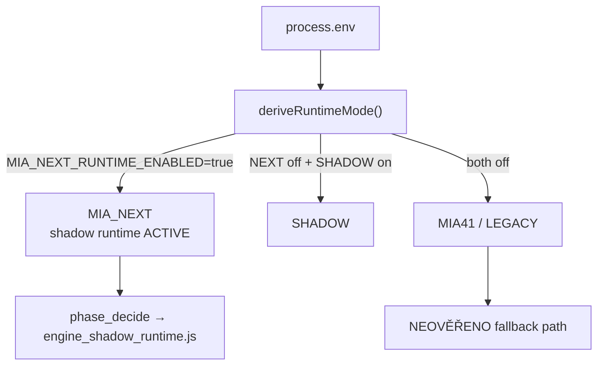

# Stav + feature flags (defaults)

> Etapa 2 — inventář stavových úložišť a env/config flagů  
> Zdroje: `scripts/MIA_CONFIG.js`, `.env.example`, `config/runtime.json`, modulové `flag.js`

---

## Přehled stavových úložišť

### In-memory (index.js + runtime moduly)

| Klíč | Typický obsah | Reset při restartu |
|------|---------------|-------------------|
| `overlayState` | miaOverlay, kojnozoutOverlay, chatFeed | ANO |
| `outputState` | proactive host, voice metadata | ANO |
| `kojnozoutState` | bowl, vitals, mood — **seed z disk** | částečně (load ze souboru) |
| `streamState` | audience counts, platform | ANO |
| `voicePlaybackState` | active TTS playback | ANO |
| `ecosystemState` | away mode, capybara flow | NEOVĚŘENO |
| `duelState` | active duel — seed z world json | částečně |
| `arenaState` | platform arena — seed z disk | částečně |
| `overlayStateCache` | TTL cache pro GET /overlay-state | ANO |

### Disk (`data/`)

| Soubor | Modul | Default path v config |
|--------|-------|----------------------|
| `kojnozout-state.json` | `MIA_KOJNOZROUT_PERSISTENCE.js` | ano |
| `kojnozout-world.json` | `MIA_KOJNOZROUT_WORLD_PERSISTENCE.js` | ano |
| `runtime-state.json` | `core/runtime-state.js` | `phase1.runtimeState.path` |
| `viewer-memory.json` | `core/viewer-memory.js` | `phase2.viewerMemory.path` |
| `viewer-inventory.json` | `core/viewer-inventory.js` | `phase3.inventory.path` |
| `platform-arena.json` | `MIA_PLATFORM_ARENA.js` | hardcoded |
| `mia-action-queue.json` | `core/action-queue.js` | `{ enabled: bool }` |
| `mia-theme.json` | `core/theme-manager.js` | `{ themeId }` |
| `mia-session-memory.json` | `MIA_SESSION_MEMORY.js` | NEOVĚŘENO |
| `streamer-identity.json` | streamer identity | NEOVĚŘENO |
| `gift-map-stats.json` | gift map | NEOVĚŘENO |
| `mia-chat-lexicon.json` | chat lexicon | NEOVĚŘENO |
| `streamer-profiles/` | `core/streamer-profiles.js` | `phase4.streamerProfiles.path` |

### Overlay-state HTTP

| Endpoint | Cache | Sanitizace |
|----------|-------|------------|
| `GET /overlay-state` | `MIA_OVERLAY_STATE_CACHE_MS=450` | `stripValueFieldsForPublic` — no coins |
| `GET /overlay-state?profile=X` | bypass cache | jen pokud `MIA_ENGINE2_STUB=1` |

---

## Feature flags — hlavní tabulka

| Flag / config key | Default | Efekt |
|-------------------|---------|-------|
| **MIA_NEXT_RUNTIME_ENABLED** | `true` (implicit) | Runtime mode = MIA_NEXT |
| **MIA_SHADOW_RUNTIME_ENABLED** | `false` | SHADOW mode pokud NEXT off |
| **MIA_ACTIVE_RUNTIME** | unset | Explicit override: MIA41/LEGACY/SHADOW/MIA_NEXT |
| **MIA_ACTION_QUEUE** | **OFF** | Action queue; kill switch `=0` vždy wins |
| **MIA_ACTION_QUEUE_FULL** | OFF | Full routing místo advisory enqueue |
| **MIA_ENGINE2_STUB** | **OFF** (`0`) | Engine2 admin snapshot, overlay profiles |
| **MIA_DUAL_VOICE** | **OFF** (unset) | Druhý TTS pro deferred Koj companion |
| **MIA_KICK_ENABLED** | **ON** (`true`) | Kick Pusher bridge |
| **MIA_KICK_MODE** | `realtime` | `webhook` = POST /kick/webhook |
| **MIA_TWITCH_ENABLED** | **OFF** | Twitch EventSub bridge |
| **MIA_TELEGRAM_ENABLED** | **OFF** | Telegram user mode |
| **MIA_THEME_MANAGER** | **OFF** | CSS theme vars v overlay-state |
| **MIA_TTS_ENABLED** | **ON** | TTS engine |
| **MIA_OVERLAY_ENABLED** | **ON** | Overlay system |
| **MIA_OVERLAY_OBS_CONTROL_ENABLED** | **OFF** | OBS control from overlay |
| **MIA_DIRECTOR** | **ON** (runtime.json) | MIA director advisory plan |
| **MIA_COMBO_MOMENTS** | **ON** | Combo moment detector |
| **MIA_VIEWER_MEMORY** | **ON** | Viewer memory persist |
| **MIA_VIEWER_INVENTORY** | **ON** | Inventory stubs |
| **MIA_TECH_FORMS** | **OFF** | Tech forms runtime |
| **MIA_USER_MODE** | **OFF** | Phase 4 user mode stub |
| **MIA_BATTLE_MVP** | **ON** | Battle state machine vs instant |
| **MIA_STREAM_WATCHDOG** | **ON** | Ingest/OBS watchdog |
| **MIA_DEBUG_ROUTES** | OFF | Debug simulate routes |
| **MIA_INGEST_SECRET** | unset | Ingest auth guard |
| **MIA_PUBLIC_CHAT_WRITE_ENABLED** | **OFF** | Public chat write |
| **MIA_GIFT_ECONOMY_TIERS** | `coins` | Tier prahy (vs `legacy`) |
| **MIA_T0_OVERLAY** | OFF (commented) | T0 engagement overlay |
| **MIA_SOLO_STREAM_ENABLED** | OFF (commented) | Solo stream mode |
| **MIA_QUIET_BEHAVIOR** | unset | Solo stream trigger |
| **MIA_PROACTIVE_HOST** | OFF (commented) | Proactive host |
| **MIA_OBS_VISION** | OFF (commented) | OBS vision dashboard |
| **MIA_OBS_HANDS** | ON (commented) | Auto browser overlay creation |
| **MIA_PREFLIGHT_ON_START** | `0` | Preflight on boot |

---

## config/runtime.json — strukturované flagy

```json
{
  "phase1": {
    "actionQueue": { "enabled": false },
    "eventLog": { "enabled": true },
    "watchdog": { "enabled": true }
  },
  "phase2": {
    "director": { "enabled": true },
    "comboMoments": { "enabled": true },
    "viewerMemory": { "enabled": true },
    "themeManager": { "enabled": false }
  },
  "phase3": {
    "techForms": { "enabled": false },
    "battleMvp": { "enabled": true },
    "inventory": { "enabled": true }
  },
  "phase4": {
    "userMode": { "enabled": false },
    "streamerProfiles": { "enabled": true }
  }
}
```

**Priorita override (Action Queue):**

1. `MIA_ACTION_QUEUE=0` → vždy OFF
2. `MIA_ACTION_QUEUE=1` → ON
3. Admin runtime override (in-memory)
4. `data/mia-action-queue.json`
5. `runtime.json phase1.actionQueue.enabled`

---

## Runtime mode diagram



---

## Engine2 vs MIA NEXT — rozlišení

| | MIA NEXT (shadow) | Engine2 stub |
|--|-------------------|--------------|
| Flag | default ON (runtime mode) | `MIA_ENGINE2_STUB=1` |
| Modul | `MIA_NEXT/engine_shadow_runtime.js` | `engine2/` |
| Live stream | **ANO** — phase_decide | **NE** — admin preview only |
| Admin | N/A | `/admin` engine2 snapshot |

---

## OBS / stream env (selected)

| Flag | Default |
|------|---------|
| OBS_WS_URL | `ws://127.0.0.1:4455` |
| OBS_SCENE_NAME | `SPINAK_ENGINE_GIFTS` |
| MIA_STREAM_PLATFORM | `auto` |
| MIA_OBS_OVERLAY_MODE | `split` (commented) |
| MIA_BIND_HOST | `127.0.0.1` (commented) |

---

## Slabá místa (pouze pozorování)

1. **Flagy na třech místech:** env, `MIA_CONFIG.js`, `config/runtime.json` — různé precedence per modul.
2. **Action queue disk vs env:** admin toggle persistuje do JSON, ale env kill switch může matovat operátora.
3. **MIA_NEXT default ON není env flag** — implicitní v `deriveRuntimeMode()` — méně viditelné než explicit env.
4. **Theme manager duplicita:** `phase2.themeManager` i `postDod.themeManager` v runtime.json.

---

## NEOVĚŘENO

- Kompletní seznam env vars v `MIA_CONFIG.js` buildRuntimeConfig (673+ řádků) — zde uvedeny hlavní
- `shared/mia-configuration-core/configurationManager.js` feature flag map — vztah k live runtime
- Které flags čte pouze test vs produkce
