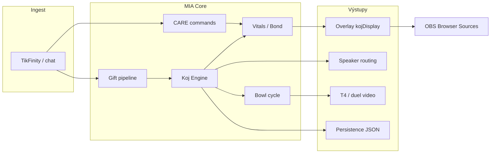

# Etapa 3C — Shrnutí (Kojnožrout vs kánon)

**Datum:** 2026-07-27  
**Status:** **Etapa 3C HOTOVO** (docs only, uncommitted OK)

---

## Počty z compliance matrix (79 pravidel KJ-01…KJ-79)

| Stav | Počet | Podíl |
|------|-------|-------|
| ✅ Shoda | 58 | 73 % |
| ⚠ Drift / částečná | 12 | 15 % |
| ❌ Rozpor | 1 | 1 % |
| ❓ Neověřeno | 1 | 1 % |
| ⬜ Budoucí (N/A) | 3 | 4 % |

---

## Verdikt

Systém **Kojnožrout** je **kánonicky stabilní v jádru**:

- Samostatná entita s vitals, CARE, bond/neglect, evolucí a runtime overlay ✅
- Default klidný režim + selektivní aktivace (gift, care, duel, combo) ✅
- 6 CARE typů s validací, rewards a `pece` menu ✅
- Runtime sprite/pose pipeline (single catalog, wander/walk rules) ✅
- MIA → Koj reakční pořadí (~3,2 s deferred companion) ✅
- Duel/arena v miaPoints, battle choreografie ✅
- Persistence `data/kojnozout-state.json` + world JSON ✅
- Public `kojDisplay` bez coin metrik ✅

**Jediný tvrdý rozpor (❌):** chybějící **Trust** jako CARE výstup (KJ-23).

Drift se koncentruje do **bowl 95 % vs 100 % T4 trigger** (sdíleno s 3A G-49), **4 vizuální pásma misky**, **viewer presence proxy**, **speaker test mezera** a **dokumentační drift** (eating 12→16, PNG count).

---

## Top 5 rizik (priorita)

1. **Bowl full 95–99 % bez T4** — celebrate/visual „plná“ od 95 %, `shouldTriggerFullBowl` až při 100 % (GAP-C01, sdíleno s 3A GAP-03).

2. **Trust field chybí** — kánon CARE výstupy vs bond-only model (GAP-C02).

3. **Speaker routing test gap** — kód defaultuje MIA u chatu, chybí contract (GAP-C05).

4. **Viewer presence 🟡** — engagement proxy místo viewer-count vitals (GAP-C04).

5. **Chybějící bowl band contract** — 30/60/95 a 95/100 trigger nehlídané regresí (T-C01).

---

## Co je silné (neměnit bez důvodu)

1. `MIA_KOJNOZROUT_ENGINE.js` + VITALS + DISPLAY — jednotný kojDisplay snapshot  
2. `MIA_KOJNOZROUT_CARE*.js` + BOND — validovaná péče s neglect tiers  
3. `kojnozrout-runtime.html` + split libs — pose catalog bez duplicity  
4. `MIA_KOJNOZROUT_REACTION_ORDER.js` — MIA first, Koj companion  
5. 26+ contract testů v `tests/kojnozout_*` / `tests/koj_*`  

*(Shodné s `KANON_MIA_ALIGNMENT.md` § Koj, `KOJNOZROUT_CANON_ALIGNMENT.md`)*

---

## Vztah k Etapa 3A / 3B

| Dokument | Zaměření |
|----------|----------|
| **3A** | Gift video, bowl **fill wiring**, Kapybara, spam cap |
| **3B** | miaPoints, ledger, duel **power sémantika** |
| **3C (tento)** | **Koj behavior** — vitals, CARE, sprite, neglect, bowl **vizuální strana**, speaker, persistence |

Příklad: 3A ⚠ bowl 4 pásma + 3C ⚠ 95/100 T4 = stejný drift z různých úhlů.

---

## Dopad na ostatní moduly



### Gift systém
```
Ovlivňuje: ANO
Neovlivňuje: CARE validace, bond decay timing, pose wander rules
Vyžaduje nový audit: NE (3A hotovo; při změně Koj vitals→gift reakce znovu KJ-08, KJ-35)
```

### MIA body / economy
```
Ovlivňuje: ANO (support→bowl gain, duel power v miaPoints)
Neovlivňuje: coin tier resolver, spam reward cap, ledger schema
Vyžaduje nový audit: NE (3B hotovo; při změně applySupportToKojnozout znovu KJ-41, KJ-66)
```

### Bowl
```
Ovlivňuje: ANO (vizuální pásma, celebrate, T4 cycle — sdílený engine)
Neovlivňuje: gift map fill % per tier (3A), MIA body konverze (3B)
Vyžaduje nový audit: ANO (když se změní Koj bowl threshold 95/100 nebo visualLevel pásma)
```

### Inventář
```
Ovlivňuje: ANO (CARE rewards, item commands, batoh overlay)
Neovlivňuje: enterprise gift rewards roll (3A), coin ekonomika
Vyžaduje nový audit: ANO (když se změní Koj backpack persist nebo item→vitals map)
```

### Battle / duel
```
Ovlivňuje: ANO (duel overlay, vitals during battle, choreografie)
Neovlivňuje: platform arena team bar body split (3B)
Vyžaduje nový audit: HOTOVO — Etapa 3H `docs/MIA_AUDIT_ETAPA_3H_BATTLE/` (při změně vitals block / pose map znovu BT-36…40 + KJ-*)
```

### Overlay
```
Ovlivňuje: ANO (kojDisplay, bowl HUD, runtime HTML, public strip)
Neovlivňuje: gift animation overlay, combo wave UI
Vyžaduje nový audit: ANO (když se změní buildKojDisplaySnapshot nebo kojnozrout-runtime.html)
```

### TTS / speaker
```
Ovlivňuje: ANO (Koj primary u giftu, deferred companion, NOT default chat)
Neovlivňuje: MIA body subtext copy (3B), T2+ audio policy (3A)
Vyžaduje nový audit: NE — TTS strana v Etapa 3E (docs/MIA_AUDIT_ETAPA_3E_VOICE_TTS/); při změně Koj speaker lanes znovu KJ-70 + 3E VT-23/VT-28
```

### Persistence
```
Ovlivňuje: ANO (kojnozout-state.json, world JSON, bond/evolution round-trip)
Neovlivňuje: gift-map-stats, supporter streak (3B)
Vyžaduje nový audit: HOTOVO — Etapa 3G `docs/MIA_AUDIT_ETAPA_3G_PERSISTENCE_RECOVERY/` (walk/bond schema změny → znovu PR-* + KJ-*)
```

### OBS
```
Ovlivňuje: ANO (browser sources, anchors, render-report propriocepce)
Neovlivňuje: video engine rotation (3A), OBS hands safe-call obecně
Vyžaduje nový audit: NE — plný OBS audit hotovo v Etapa 3D (docs/MIA_AUDIT_ETAPA_3D_OBS_RUNTIME/); Koj změny jen re-run KJ-02, KJ-04, KJ-55
```

### Editor
```
Ovlivňuje: ČÁSTEČNĚ (MIA Paint Koj bridge, asset pipeline, pose generate)
Neovlivňuje: live stream CARE runtime, bowl cycle
Vyžaduje nový audit: NE (graphics/editor mimo live behavior; při změně Koj asset canon znovu KJ-52, KJ-56)
```

---

## Artefakty Etapa 3C

| Soubor | Obsah |
|--------|--------|
| `00_SCOPE.md` | Rozsah Koj, vztah k 3A/3B |
| `01_CANON_RULES_EXTRACT.md` | 65 kánonních pravidel |
| `02_COMPLIANCE_MATRIX.md` | 79 řádků KJ-* |
| `03_GAPS.md` | 13 mezer se severity |
| `04_TESTS_COVERAGE.md` | Contract map + 8 chybějících testů |
| `05_SUMMARY.md` | Tento dokument |

---

## Etapa 3C HOTOVO

Audit shody Kojnožrout behavior s kánonem je **kompletní**.  
**Žádné změny kódu** nebyly provedeny.

*Navazuje: **Etapa 3D OBS Runtime** ✅ · **Etapa 3E MIA Voice/TTS** ✅ (`docs/MIA_AUDIT_ETAPA_3E_VOICE_TTS/`). Příští: **Etapa 3F Overlay Runtime**.*
---

## Povinná souhrnná tabulka (audit standard)

| Kategorie | Počet |
|-----------|-------|
| Guardrails | 7 |
| Implementováno | 70 |
| Testováno | 58 |
| Chybí test | 21 |
| Drift | 12 |
| Rozpor | 1 |
| Riziko vysoké | 1 |
| Riziko střední | 5 |
| Riziko nízké | 4 |

**Poznámky k tabulce:**
- **Guardrails** = GR-K01…GR-K07 subset (7 pravidel; 5 plně ✅, 2 ⚠ kvůli test/threshold drift).
- **Implementováno** = 58 ✅ + 12 ⚠ (kód existuje, detail/kánon drift).
- **Testováno** = matrix řádky KJ-01…KJ-79 s 🟢/🟡 contract důkazem v `04_TESTS_COVERAGE.md`.
- **Chybí test** = 79 − 58 řádků bez test důkazu (8 navržených T-C01…T-C08).
- **Drift** = ⚠ v matrix; **Rozpor** = ❌ Trust (1).
- **Rizika** dle `03_GAPS.md`: 1 VYSOKÁ, 5 STŘEDNÍ, 4 NÍZKÁ (+ 3 INFO ⬜ mimo skóre).
