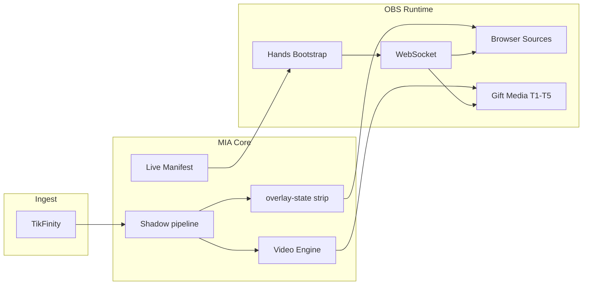

# Etapa 3D — Shrnutí (OBS Runtime vs kánon)

**Datum:** 2026-07-27  
**Status:** **Etapa 3D HOTOVO** (docs only, uncommitted OK)

---

## Počty z compliance matrix (70 pravidel OR-01…OR-70)

| Stav | Počet | Podíl |
|------|-------|-------|
| ✅ Shoda | 52 | 74 % |
| ⚠ Drift / částečná | 13 | 19 % |
| ❌ Rozpor | 0 | 0 % |
| ❓ Neověřeno | 5 | 7 % |

---

## Verdikt

**OBS Runtime** MIA Stream Mode je **kánonicky stabilní jako render vrstva**:

- TikFinity → MIA → OBS architektura dodržena ✅
- Business logika v MIA; OBS = browser sources + media sloty + WS transport ✅
- Live manifest (`MIA_OBS_LIVE_MANIFEST.js`) jediný zdroj pravdy ✅
- Split overlay režim; hub legacy jen ⚠ drift v docs/kódu
- Cache bust vrstvy **36 / 37 / 49** — dual-layer u Koj runtime záměrně ✅
- `obs:refresh-overlays`, `obs:apply-hands`, post-connect bootstrap chain ✅
- Body parts (`MIA_HEAD`…`MIA_FEET`) **default OFF** na live ✅
- Scene guard + watchdog + safe call ✅
- Public overlay strip (miaPoints only) na MIA hranici — OBS jen polluje ✅
- **R1-C PASS 2026-07-26** — historický live důkaz speech 36, gift 37, Koj 49, layout, audio, combo HUD

**Žádný tvrdý rozpor (❌)** — OBS neporušuje render-only roli.

Drift se koncentruje do **docs bust v30 vs v37**, **away host stub**, **live reconnect/portrait neověřeno**, **browser refresh default OFF**, **scene guard / refresh script bez fast contract**.

---

## Top 5 rizik (priorita)

1. **Live reconnect po OBS crash** — watchdog + bootstrap existují, ale bez fresh live testu (GAP-D01, ❓).

2. **Portrait 1080×1920 end-to-end** — skript ano, R1-C jen landscape (GAP-D02, ❓).

3. **`OBS_LIVE_SETUP.md` gift bust v30** — operátorský doc vs kód `37-stream-polish` (GAP-D03).

4. **Dual bust deploy nuance** — manifest URL v36, Koj split libs v49; špatný refresh = staré JS (GAP-D07).

5. **Away / NEJSEM TU ne stream-ready** — OBS vrstvy OK, chování stub (GAP-D06; sdíleno s capability Etapa 3).

*Poznámka: bowl 95/100, Trust — **decision later** v 3A/3C, ne v scope 3D.*

---

## Co je silné (neměnit bez důvodu)

1. `MIA_OBS_LIVE_MANIFEST.js` — katalog vrstev, aliasy, bust konstanty  
2. `MIA_OBS_BOOTSTRAP.js` + `MIA_OBS_SAFE_CALL.js` — connect/reconnect/health  
3. `MIA_OBS_POST_CONNECT_RUNTIME.js` — hands → layout → voice → layers  
4. `MIA_OBS_HANDS.js` — idempotentní vytvoření browser sources  
5. 18 OBS suites v `preflight:fast` + R1-C historický PASS  

*(Shodné s `docs/OBS_LIVE_SETUP.md`, `docs/KANON_MIA_ALIGNMENT.md` § Stream Engine)*

---

## Vztah k Etapa 3A / 3B / 3C

| Dokument | Zaměření | Vztah k 3D |
|----------|----------|------------|
| **3A** | Gift video, bowl fill, overlay public API | 3D ověřuje **OBS transport** gift overlay + media sloty; ekonomiku neopakuje |
| **3B** | miaPoints, ledger, strip sémantika | 3D potvrzuje OBS **nepočítá** body — polluje stripnutý snapshot |
| **3C** | Koj vitals, CARE, bowl behavior, render-report | 3D ověřuje **browser sources** Koj/bowl, layout anchors, propriocepce endpoint |

Příklad: 3C ⚠ bowl 95/100 T4 + 3A ⚠ pásma = **Koj/MIA logika**; 3D ✅ bowl overlay URL/transform = **OBS vrstva**.

---

## Dopad na ostatní moduly



### Gift systém
```
Ovlivňuje: ANO (gift anim browser v37, media sloty T1-T5, combo moment vrstva)
Neovlivňuje: tier resolver, spam cap, rotationIndex logika (MIA)
Vyžaduje nový audit: NE (3A hotovo; při změně gift OBS slot map znovu OR-38, OR-58)
```

### MIA body / economy
```
Ovlivňuje: ANO (browser polluje stripnutý snapshot — combo/spam HUD)
Neovlivňuje: konverze 7.5, ledger, supporter profily (3B)
Vyžaduje nový audit: NE (3B hotovo; při změně public API strip znovu OR-06, GR-O03)
```

### Koj
```
Ovlivňuje: ANO (MIA_KOJ_RUNTIME, MIA_BOWL browser, transforms, render-report transport)
Neovlivňuje: vitals, CARE, bowl 95/100 trigger (3C)
Vyžaduje nový audit: NE (3C hotovo; při změně Koj OBS anchors znovu OR-36, OR-37, OR-49)
```

### Bowl
```
Ovlivňuje: ANO (bowl overlay browser source, pozice R-top)
Neovlivňuje: fill % ekonomika, T4 trigger threshold (3A/3C — decision later)
Vyžaduje nový audit: NE (sdílené s 3C; OBS změna layoutu → OR-37)
```

### Overlay
```
Ovlivňuje: ANO (core — sync, refresh, manifest, split URLs)
Neovlivňuje: overlay HTML UX / pin / public strip sémantika (3F hotovo — poll HTML; MIA state)
Vyžaduje nový audit: NE — Etapa 3F HOTOVO (docs/MIA_AUDIT_ETAPA_3F_OVERLAY_RUNTIME/); při změně split catalog / bust policy znovu OR-* + 3F OV-55/OV-71
```

### TTS
```
Ovlivňuje: ANO (MIA_VOICE browser, reroute audio, ensure-voice, anti-echo mute video)
Neovlivňuje: Edge TTS engine, speaker routing policy (→ 3E)
Vyžaduje nový audit: NE — Etapa 3E HOTOVO (docs/MIA_AUDIT_ETAPA_3E_VOICE_TTS/); při změně OBS voice monitor/anti-echo znovu OR-57, OR-62 + 3E VT-07/VT-09
```

### Battle
```
Ovlivňuje: ANO (MIA_DUEL overlay, obs:ensure-arena-battle)
Neovlivňuje: duel scoring miaPoints (3B), Koj choreografie vitals (3C)
Vyžaduje nový audit: NE (při změně battle OBS vrstev znovu OR-68)
```

### Editor
```
Ovlivňuje: ČÁSTEČNĚ (body parts catalog, MIA_GRAPHICS_PREVIEW source, hybrid sync URL)
Neovlivňuje: live stream runtime rozhodování
Vyžaduje nový audit: HOTOVO — docs/MIA_AUDIT_ETAPA_3I_EDITOR/ (body OFF → OR-08–10)
```

### Persistence
```
Ovlivňuje: NE (OBS nepersistuje stav)
Neovlivňuje: —
Vyžaduje nový audit: NE
```

### Ingest
```
Ovlivňuje: NE (TikFinity → MIA; OBS mimo ingest)
Neovlivňuje: —
Vyžaduje nový audit: NE
```

---

## Co je NEOVĚŘENO bez live OBS (tento běh)

| Oblast | Důkaz místo toho |
|--------|------------------|
| Full session reconnect po kill obs64 | Unit watchdog/bootstrap; GAP-D01 |
| Portrait 1080×1920 layout | Kód `obs:portrait`; GAP-D02 |
| VB-Cable → TikTok mic | Docs + ensure-voice; GAP-D15 |
| Fresh OBS bez sources | Hands unit test; GAP-D14 |
| Audio echo under load | R1-C PASS 2026-07-26 historicky |

---

## Artefakty Etapa 3D

| Soubor | Obsah |
|--------|--------|
| `00_SCOPE.md` | Rozsah OBS, vztah k 3A/3B/3C |
| `01_CANON_RULES_EXTRACT.md` | 52 kánonních pravidel + GR-O01…08 |
| `02_COMPLIANCE_MATRIX.md` | 70 řádků OR-* |
| `03_GAPS.md` | 15 mezer (7 STŘEDNÍ, 5 NÍZKÁ, 3 ❓) |
| `04_TESTS_COVERAGE.md` | 18 fast suites + 8 navržených T-D* |
| `05_SUMMARY.md` | Tento dokument |

---

## Etapa 3D HOTOVO

Audit shody **OBS Runtime** s kánonem je **kompletní**.  
**Žádné změny kódu** nebyly provedeny.  
Mezery (Trust, bowl 95/100, away stub, docs bust) jsou záznam pro **DECISION later**, ne auto-fix.

*Příští krok po 3D byl **Etapa 3E MIA Voice/TTS** — **HOTOVO** 2026-07-27: `docs/MIA_AUDIT_ETAPA_3E_VOICE_TTS/`. **Etapa 3F Overlay Runtime** — **HOTOVO**: `docs/MIA_AUDIT_ETAPA_3F_OVERLAY_RUNTIME/` (72 OV-*, 0 ❌). Další: **Etapa 3G Persistence & Recovery**.*

---

## Povinná souhrnná tabulka (audit standard)

| Kategorie | Počet |
|-----------|-------|
| Guardrails | 8 |
| Implementováno | 65 |
| Testováno | 48 |
| Chybí test | 22 |
| Drift | 13 |
| Rozpor | 0 |
| Riziko vysoké | 0 |
| Riziko střední | 7 |
| Riziko nízké | 5 |

**Poznámky k tabulce:**
- **Guardrails** = GR-O01…GR-O08 (8 pravidel; 7 plně ✅, 1 ❓ live echo historicky R1-C).
- **Implementováno** = 52 ✅ + 13 ⚠ (kód existuje, detail/docs/live drift).
- **Testováno** = matrix řádky s 🟢/🟡 contract nebo R1-C důkazem v `04_TESTS_COVERAGE.md`.
- **Chybí test** = 70 − 48 řádků bez plného test důkazu (8 navržených T-D01…T-D08).
- **Drift** = ⚠ v matrix; **Rozpor** = 0.
- **Rizika** dle `03_GAPS.md`: 0 VYSOKÁ, 7 STŘEDNÍ, 5 NÍZKÁ (+ 3 ❓ INFO mimo skóre).
