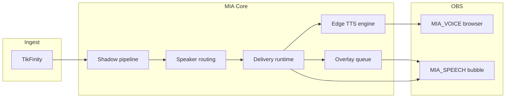

# Etapa 3E — Shrnutí (MIA Voice / TTS vs kánon)

**Datum:** 2026-07-27  
**Status:** **Etapa 3E HOTOVO** (docs only, uncommitted OK)

---

## Počty z compliance matrix (70 pravidel VT-01…VT-70)

| Stav | Počet | Podíl |
|------|-------|-------|
| ✅ Shoda | 50 | 71 % |
| ⚠ Drift / částečná | 12 | 17 % |
| ❌ Rozpor | 0 | 0 % |
| ❓ Neověřeno | 8 | 11 % |

---

## Verdikt

**MIA Voice / TTS** Stream Mode je **kánonicky stabilní** jako single-authority speech path:

- Edge TTS (`edge-tts-universal`) + Vlasta/Antonín + cache ✅  
- Dual voice **default OFF** (`MIA_DUAL_VOICE`) ✅  
- Speaker routing: MIA scéna / Koj gift; deferred overlay bez TTS ✅  
- Voice-first: bublina skrytá při TTS ✅  
- Gift s hudbou → bublina, TTS potlačen ✅  
- Speak queue (max 6) + `voiceHoldUntilTs` + priority lock ✅  
- Flush overlay fronty po TTS — kód ✅, fast test ⚠  
- `MIA_VOICE` single sink + revive 13f + anti-echo wiring ✅ (live ❓)  
- AQ default OFF; TTS nezávislé na AQ ✅  
- Master canon 0035 nadstavby (Emotion Effects Analytics) = ⚠ aspirace, ne ❌  

**Žádný tvrdý rozpor (❌).**

Drift se koncentruje do **live audio neověřeno v tomto běhu**, **flush smoke mimo fast**, **guardrails.mdc bez dual-voice bullet**, **master 0035 vs stream subset**.

---

## Top 5 rizik (priorita) — bez auto-fix

1. **Live anti-echo / single path** — kód OK; fresh live chybí (GAP-E01, ❓; hist. R1-C 2026-07-26).  
2. **Gift+chat burst timing** — queue existuje; live overlap **nikdy** (GAP-E02).  
3. **Flush overlay po TTS mimo fast** — regrese nehlídaná ve `preflight:fast` (GAP-E03).  
4. **Edge outage** — žádný offline TTS; degradace nedokumentovaná end-to-end (GAP-E04).  
5. **Dual voice OFF chybí v mia-guardrails.mdc** — runtime OK, agent guardrail drift (GAP-E05).

---

## Co je silné (neměnit bez důvodu)

1. `MIA_SPEAKER_ROUTING.js` — voice-first, dual OFF, music→bubble  
2. `MIA_TTS_ENGINE.js` — Edge + prosody + cache  
3. `MIA_DELIVERY_RUNTIME.js` — speak queue + flush after voice  
4. `MIA_DUAL_VOICE.js` — jednoznačný opt-in  
5. `mia-voice-overlay.html` + `obs:revive-voice` — authority + autoplay unlock  
6. Contract suite `speaker_routing` + voice_*_ctx v preflight:fast  

---

## Vztah k Etapa 3A / 3C / 3D

| Dokument | Zaměření | Vztah k 3E |
|----------|----------|------------|
| **3A** | Gift video, T2+ audio | 3E ověřuje **TTS suppress** při music gift |
| **3C** | Koj vitals, dual OFF note | 3E ověřuje **TTS/speech routing**, ne CARE |
| **3D** | OBS manifest, `MIA_VOICE` browser | 3E ověřuje **engine + queue + policy**; OBS infra v 3D |

---

## Dopad na ostatní moduly



### Gift systém
```
Ovlivňuje: ANO (music gift → bubble_over_music, suppressGiftVoice, mute video during voice)
Neovlivňuje: tier resolver, spam cap čísla, rotationIndex (3A)
Vyžaduje nový audit: NE (při změně T2+ audio policy znovu VT-33, VT-51)
```

### MIA body / economy
```
Ovlivňuje: ČÁSTEČNĚ (lipTrack na #miaHolo / body speak parity)
Neovlivňuje: miaPoints, ledger (3B)
Vyžaduje nový audit: NE (lip quality → graphics; body economy ne)
```

### Koj
```
Ovlivňuje: ANO (Koj primary TTS u giftu, Antonín, deferred overlay bez dual)
Neovlivňuje: vitals, CARE, bowl 95/100 (3C)
Vyžaduje nový audit: NE (při změně Koj speaker lanes znovu VT-28, VT-23; 3C KJ-70)
```

### Bowl
```
Ovlivňuje: NE (voice neřídí bowl fill)
Neovlivňuje: —
Vyžaduje nový audit: NE
```

### Overlay
```
Ovlivňuje: ANO (voice-first hide bubble, voiceMirror filter, queue flush, voicePlayback)
Neovlivňuje: plný layout / public strip sémantika (3F hotovo)
Vyžaduje nový audit: NE — Etapa 3F HOTOVO (docs/MIA_AUDIT_ETAPA_3F_OVERLAY_RUNTIME/); při změně pin/TTS race znovu VT-06/VT-47 + 3F OV-33…35
```

### OBS
```
Ovlivňuje: ANO (MIA_VOICE monitor, anti-echo, ensure/revive) — transport v 3D
Neovlivňuje: bootstrap/manifest/watchdog (3D hotovo)
Vyžaduje nový audit: NE (live echo retest sdílený s 3D GAP-D13)
```

### Battle
```
Ovlivňuje: ČÁSTEČNĚ (voice lock může blokovat overlay; battle megafon effects ⚠ master)
Neovlivňuje: duel scoring
Vyžaduje nový audit: NE (→ 3H při battle voice lines)
```

### Editor
```
Ovlivňuje: ČÁSTEČNĚ (lip/viseme tooling, graphics 13w–13z)
Neovlivňuje: live TTS policy
Vyžaduje nový audit: NE (→ 3I Editor)
```

### Persistence
```
Ovlivňuje: NE (holdUntilTs in-memory)
Neovlivňuje: —
Vyžaduje nový audit: HOTOVO — Etapa 3G `docs/MIA_AUDIT_ETAPA_3G_PERSISTENCE_RECOVERY/` (voice ephemeral by design; PR-64)
```

### Ingest
```
Ovlivňuje: NE (TTS až po actionResult)
Neovlivňuje: —
Vyžaduje nový audit: NE
```

---

## Poslední ověření (povinná tabulka)

| Oblast | Stav | Poslední ověření |
|--------|------|------------------|
| Dual voice OFF default | ✅ | fresh contract 2026-07-27 |
| Music gift → bubble, TTS off | ✅ | fresh contract 2026-07-27 |
| Voice-first hide bubble | ✅ | fresh contract 2026-07-27 |
| Speak queue + holdUntilTs | ✅ | fresh contract 2026-07-27 |
| Edge TTS wiring / hlasy | ✅ | fresh code 2026-07-27 |
| Single MIA_VOICE / no echo | ❓ | hist. R1-C Audio **2026-07-26** |
| Anti-echo Desktop mute | ❓ | hist. R1-C **2026-07-26** |
| obs:ensure-voice E2E | ❓ | nikdy (tento běh) |
| Gift+chat burst | ❓ | nikdy |
| Edge outage fallback | ❓ | nikdy |
| Dual ON under load | ❓ | hist. R1-C **2026-07-26** |
| Lip sync visual quality | ❓ | nikdy fresh |

> Historický PASS **nepovažovat** za fresh live ověření z 2026-07-27.

---

## Co je NEOVĚŘENO bez live OBS / Edge

| Oblast | Důkaz místo toho |
|--------|------------------|
| 1× TTS bez echo | Contract revive + hist. R1-C; GAP-E01 |
| VB-Cable → TikTok mic | Docs + ensure-voice; GAP-E07 |
| Edge outage | Capability note; GAP-E04 |
| Burst gift+chat | Unit queue; GAP-E02 |
| Dual ON overlap | R1-C hist.; GAP-E14 |

---

## Artefakty Etapa 3E

| Soubor | Obsah |
|--------|--------|
| `00_SCOPE.md` | Rozsah Voice/TTS, vztah k 3A–3D, metodika Poslední ověření |
| `01_CANON_RULES_EXTRACT.md` | 70 kánonních pravidel + GR-V01…08 |
| `02_COMPLIANCE_MATRIX.md` | 70 řádků VT-* + Poslední ověření |
| `03_GAPS.md` | 15 mezer (7 STŘEDNÍ, 6 NÍZKÁ, 2 ❓ INFO) |
| `04_TESTS_COVERAGE.md` | 8 fast suites + 8 navržených T-E* |
| `05_SUMMARY.md` | Tento dokument |

---

## Etapa 3E HOTOVO

Audit shody **MIA Voice / TTS** s kánonem je **kompletní**.  
**Žádné změny aplikačního kódu** nebyly provedeny.  
Mezery jsou záznam pro **DECISION later**, ne auto-fix.

*Příští krok (roadmap): **Etapa 3G Persistence & Recovery**. Etapa **3F Overlay Runtime** je HOTOVO — `docs/MIA_AUDIT_ETAPA_3F_OVERLAY_RUNTIME/`.*

---

## Povinná souhrnná tabulka (audit standard)

| Kategorie | Počet |
|-----------|-------|
| Guardrails | 8 |
| Implementováno | 62 |
| Testováno | 52 |
| Chybí test | 18 |
| Drift | 12 |
| Rozpor | 0 |
| Riziko vysoké | 0 |
| Riziko střední | 7 |
| Riziko nízké | 6 |

**Poznámky k tabulce:**
- **Guardrails** = GR-V01…GR-V08 (8; většina ✅, live echo/anti-echo ❓, flush ⚠).
- **Implementováno** = 50 ✅ + 12 ⚠ (kód existuje / aspirace master).
- **Testováno** = řádky s 🟢/🟡 důkazem v `04_TESTS_COVERAGE.md` (~52).
- **Chybí test** = 70 − 52 (8 navržených T-E01…T-E08).
- **Drift** = ⚠ v matrix; **Rozpor** = 0.
- **Rizika** dle `03_GAPS.md`: 0 VYSOKÁ, 7 STŘEDNÍ, 6 NÍZKÁ (+ 2 ❓ INFO).
