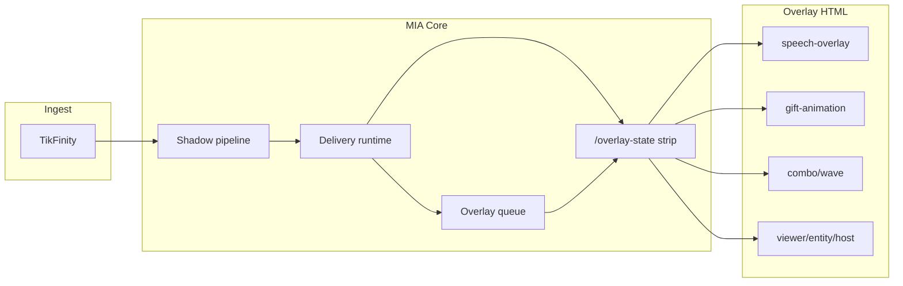

# Etapa 3F — Shrnutí (Overlay Runtime vs kánon)

**Datum:** 2026-07-27  
**Status:** **Etapa 3F HOTOVO** (docs only, uncommitted OK)

---

## Počty z compliance matrix (72 pravidel OV-01…OV-72)

| Stav | Počet | Podíl |
|------|-------|-------|
| ✅ Shoda | 62 | 86 % |
| ⚠ Drift / částečná | 8 | 11 % |
| ❌ Rozpor | 0 | 0 % |
| ❓ Neověřeno | 2 | 3 % |

*⚠: OV-18, OV-23, OV-43, OV-47, OV-51, OV-61, OV-68, OV-71. ❓: OV-09, OV-26.*

---

## Verdikt

**Overlay Runtime** Stream Mode je **kánonicky stabilní** jako presentation layer:

- Public `/overlay-state` strip — jen `miaPoints`, žádné coins ✅  
- Overlay queue + priority + flush po TTS — kód ✅ (flush ⚠ mimo fast)  
- `pickActiveOverlay` priority→updatedAt + pin break + TTS wins ✅  
- `voiceMirror` filter + voicePlayback mirror ✅  
- Music gift → bubble path (overlay side) ✅  
- Combo / spam wave HUD + gift anim entrypoint 37 ✅  
- Viewer strip / entity / host panel contracts ✅  
- Hard zones CSS + Engine2 profiles stub OFF ✅  
- Live vizuál speech/gift/combo — **hist. R1-C 2026-07-26** (ne fresh)

**Žádný tvrdý rozpor (❌).**

Drift se koncentruje do **live vizuál neověřen v tomto běhu**, **layout/flush mimo preflight:fast**, **away stub**, **portrait zones**, **intent meta thin**, **poll lib neunifikován**.

---

## Top 5 rizik (priorita) — bez auto-fix

1. **Live speech/gift/combo** — kód OK; fresh live chybí (GAP-F01, ❓; hist. R1-C 2026-07-26).  
2. **Flush + layout mimo fast** — regrese nehlídaná ve `preflight:fast` (GAP-F02, GAP-F03).  
3. **Gift+chat burst bubbles** — queue/pin existují; live overlap **nikdy** (GAP-F04).  
4. **Away / NEJSEM TU** — panel OK, full away stub (GAP-F05; sdíleno s 3D).  
5. **Portrait hard zones** — CSS OK; live portrait **nikdy** (GAP-F06; sdíleno s 3D).

---

## Co je silné (neměnit bez důvodu)

1. `MIA_OVERLAY_PUBLIC_RESPONSE.js` — `stripValueFieldsForPublic`  
2. `speech-overlay.html` — `pickActiveOverlay` / pin / voiceMirror  
3. `MIA_OVERLAY_QUEUE.js` + delivery flush path  
4. `combo-overlay.html` + `MIA_COMBO_OVERLAY` + wave UI  
5. Contract suite `overlay_public_*` + `combo_overlay` + `graphics_r1` ve fast  
6. Guardrail **miaPoints only** — shoda s 3B / guardrails.mdc  

---

## Vztah k Etapa 3A–3E

| Dokument | Zaměření | Vztah k 3F |
|----------|----------|------------|
| **3A** | Gift tier, spam, rotation | 3F = HUD prezentace; math v 3A |
| **3B** | miaPoints / ledger | 3F = public strip hranice |
| **3C** | Koj vitals / CARE / bowl | 3F = bowl/entity display only |
| **3D** | OBS manifest / bust / sync | 3F = HTML poll UX; ownership bust → 3D |
| **3E** | Edge TTS / dual / MIA_VOICE | 3F = bubble/mirror; TTS engine → 3E |

---

## Dopad na ostatní moduly



### Gift systém
```
Ovlivňuje: ANO (gift-animation HUD, combo/spam moment slots, bubble_over_music text)
Neovlivňuje: tier resolver, spam cap čísla, rotationIndex (3A)
Vyžaduje nový audit: NE (při změně gift HTML entrypoints znovu OV-55…62)
```

### MIA body / economy
```
Ovlivňuje: ANO (public strip hranice — miaPoints only na /overlay-state)
Neovlivňuje: konverze 7.5, ledger (3B)
Vyžaduje nový audit: NE (při změně strip keys znovu OV-03…08 + 3B)
```

### Koj
```
Ovlivňuje: ANO (koj overlay slot, entity vitals badge, bowl/backpack display)
Neovlivňuje: vitals, CARE, bowl 95/100 (3C)
Vyžaduje nový audit: NE (při změně koj speech kandidátů znovu OV-31)
```

### Bowl
```
Ovlivňuje: ČÁSTEČNĚ (bowl overlay HTML presentation)
Neovlivňuje: fill % ekonomika
Vyžaduje nový audit: NE
```

### Voice / TTS
```
Ovlivňuje: ANO (voice-first hide, voiceMirror filter, voicePlayback mirror, flush po TTS)
Neovlivňuje: Edge TTS engine, dual voice, MIA_VOICE audio (3E hotovo)
Vyžaduje nový audit: NE (při změně pin/TTS race znovu OV-33…35 + 3E VT-06/47)
```

### OBS
```
Ovlivňuje: ANO (browser HTML entrypoints pollují stav; bust konstanty v HTML)
Neovlivňuje: bootstrap/manifest/watchdog ownership (3D hotovo)
Vyžaduje nový audit: NE (dual bust → 3D GAP-D07; live refresh sdílený)
```

### Battle
```
Ovlivňuje: ČÁSTEČNĚ (arena/duel overlay HTML entrypoints, host team bar)
Neovlivňuje: duel scoring deep
Vyžaduje nový audit: NE (→ 3H)
```

### Editor
```
Ovlivňuje: ČÁSTEČNĚ (graphics preview / body parts OFF na live)
Neovlivňuje: Paint / Graphics Studio workflow
Vyžaduje nový audit: NE — handoff `docs/MIA_AUDIT_ETAPA_3I_EDITOR/`
```

### Persistence
```
Ovlivňuje: NE (overlay state in-memory; prune ephemeral)
Neovlivňuje: —
Vyžaduje nový audit: HOTOVO — Etapa 3G `docs/MIA_AUDIT_ETAPA_3G_PERSISTENCE_RECOVERY/` (72 PR-*, 0 ❌; kritické GAP bak/multi-file/live kill)
```

### Ingest
```
Ovlivňuje: NE (overlay až po action/delivery)
Neovlivňuje: —
Vyžaduje nový audit: NE
```

---

## Poslední ověření (povinná tabulka)

| Oblast | Stav | Poslední ověření |
|--------|------|------------------|
| Public strip miaPoints only | ✅ | fresh contract 2026-07-27 |
| pickActiveOverlay priority→updatedAt | ✅ | fresh code + layout contract 2026-07-27 |
| Pin break higher priority | ✅ | fresh layout contract 2026-07-27 |
| voiceMirror filter | ✅ | fresh code 2026-07-27 |
| Music gift → bubble | ✅ | fresh speaker_routing 2026-07-27 |
| Combo / spam HUD contracts | ✅ | fresh combo_* 2026-07-27 |
| Host panel live hidden | ✅ | fresh host_mode_overlay 2026-07-27 |
| Engine2 profiles stub OFF | ✅ | fresh engine2_e3 2026-07-27 |
| Speech overlay live visual | ❓ | hist. R1-C Speech **2026-07-26** |
| Gift overlay live visual | ❓ | hist. R1-C Gift **2026-07-26** |
| Combo HUD live | ❓ | hist. R1-C krok 7 **2026-07-26** |
| Flush overlay po TTS (fast) | ⚠ | fresh code; mimo fast |
| Layout contract ve fast | ⚠ | soubor existuje; mimo fast |
| Gift+chat burst bubbles | ❓ | **nikdy** |
| Portrait hard zones live | ❓ | **nikdy** |
| Admin coin spot-check | ❓ | **nikdy** |
| Away full host flow | ⚠ | panel OK; stub behavior |

> Historický PASS **nepovažovat** za fresh live ověření z 2026-07-27.

---

## Co je NEOVĚŘENO bez live OBS

| Oblast | Důkaz místo toho |
|--------|------------------|
| Speech bubble vizuál 36 | Contract layout + hist. R1-C; GAP-F01 |
| Gift anim 37 | HTML + graphics_r1; hist. R1-C; GAP-F01 |
| Combo/spam HUD live | combo contracts; hist. R1-C; GAP-F01 |
| Burst chat+gift bubbles | Unit queue/pin; GAP-F04 |
| Portrait zones | CSS; GAP-F06 |
| Admin vs public leak | Public strip only; GAP-F09 |

---

## Artefakty Etapa 3F

| Soubor | Obsah |
|--------|--------|
| `00_SCOPE.md` | Rozsah Overlay Runtime, vztah k 3A–3E, metodika Poslední ověření |
| `01_CANON_RULES_EXTRACT.md` | 72 kánonních pravidel + GR-O01…08 |
| `02_COMPLIANCE_MATRIX.md` | 72 řádků OV-* + Poslední ověření |
| `03_GAPS.md` | 15 mezer (6 STŘEDNÍ, 7 NÍZKÁ, 2 INFO) |
| `04_TESTS_COVERAGE.md` | Fast suites + 8 navržených T-F* |
| `05_SUMMARY.md` | Tento dokument |

---

## Etapa 3F HOTOVO

Audit shody **Overlay Runtime** s kánonem je **kompletní**.  
**Žádné změny aplikačního kódu** nebyly provedeny.  
Mezery jsou záznam pro **DECISION later**, ne auto-fix.

*Etapa 3G Persistence & Recovery — **HOTOVO** 2026-07-27: `docs/MIA_AUDIT_ETAPA_3G_PERSISTENCE_RECOVERY/`. Příští krok: **Etapa 3H Battle**.*

---

## Povinná souhrnná tabulka (audit standard)

| Kategorie | Počet |
|-----------|-------|
| Guardrails | 8 |
| Implementováno | 70 |
| Testováno | 52 |
| Chybí test | 20 |
| Drift | 8 |
| Rozpor | 0 |
| Riziko vysoké | 0 |
| Riziko střední | 6 |
| Riziko nízké | 7 |

**Poznámky k tabulce:**
- **Guardrails** = GR-O01…GR-O08 (8; většina ✅, flush ⚠, zones ⚠).
- **Implementováno** = 62 ✅ + 8 ⚠ (kód existuje / partial).
- **Testováno** = řádky s 🟢/relevantní 🟡 důkazem v `04_TESTS_COVERAGE.md` (~52).
- **Chybí test** = 72 − 52 (včetně 8 navržených T-F01…T-F08).
- **Drift** = ⚠ v matrix; **Rozpor** = 0.
- **Rizika** dle `03_GAPS.md`: 0 VYSOKÁ, 6 STŘEDNÍ, 7 NÍZKÁ (+ 2 INFO).
