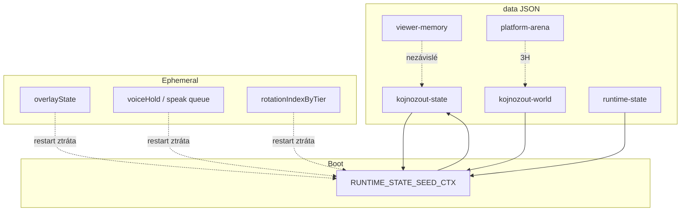

# Etapa 3G — Shrnutí (Persistence & Recovery vs kánon)

**Datum:** 2026-07-27  
**Status:** **Etapa 3G HOTOVO** (docs only, uncommitted OK)

---

## Počty z compliance matrix (72 pravidel PR-01…PR-72)

| Stav | Počet | Podíl |
|------|-------|-------|
| ✅ Shoda | 50 | 69 % |
| ⚠ Drift / částečná | 20 | 28 % |
| ❌ Rozpor | 0 | 0 % |
| ❓ Neověřeno | 2 | 3 % |

*⚠: PR-01,06,12…14,22,42,44,54,56,57,59…61,63,65,67,69…71. ❓: PR-08, PR-72.*

---

## Verdikt

**Stream Core Persistence & Recovery** je **provozně funkční** (boot hydrate, soft-fail corrupt, debounced saves, stream watchdog, replay) — ale u uživatelsky kritických témat durability je to **jeden z nejcitlivějších driftů celého projektu**:

- Koj / world / runtime-state / viewer-memory **persistují a bootují** ✅  
- `composeKojSeed` bez wipe koj souboru ✅  
- Atomic write **jen** u runtime-state (+ profiles/settings) — Koj/economy **direct write** ⚠  
- Corrupt → empty soft-fail ✅ — **bez** `.bak` / quarantine / last-good ⚠ (**VYSOKÁ** GAP-G01)  
- `version: 1` všude — **migrace v1→v2 chybí** ⚠  
- Overlay / Voice / AQ položky / gift ledger / `rotationIndexByTier` = **ephemeral** (částečně by design)  
- Master Canon **0065 / 0066 / 0075** = lab, **ne** live stream path ⚠ (ne ❌)  
- Live kill mid-write e2e = **❓ nikdy**

**Žádný tvrdý rozpor (❌) proti Stream Core guardrails.**  
**Kritické mezery** = Decision later (ne auto-fix).

---

## Top rizika (priorita) — 6 uživatelských témat

1. **Konzistence uloženého stavu (Koj + bowl + economy)** — compose Koj↔runtime OK; multi-file + různé debounce = GAP-G02 (**VYSOKÁ**).  
2. **Obnova po pádu aplikace** — hydrate ✅; mid-write / debounce loss + live e2e chybí = GAP-G03 (**VYSOKÁ**/❓).  
3. **Verzování dat** — `version:1` ano; semver upgrade ne = GAP-G05.  
4. **Migrace** — arena soft-identity only; unified runner chybí; Master 0075 lab = GAP-G05/G09.  
5. **Poškozené snapshoty** — soft-fail ano; bak/quarantine ne = GAP-G01 (**VYSOKÁ**).  
6. **Návaznost Economy / Overlay / Voice / Koj** — Koj disk ✅; Overlay/Voice ephemeral (3E/3F); streak/rotation persist thin = GAP-G06/G07/G16.

---

## Co je silné (neměnit bez důvodu)

1. `core/runtime-state.js` — atomic write + `composeKojSeed` + `kojRef`  
2. `MIA_RUNTIME_STATE_SEED_CTX` — boot hydrate  
3. `MIA_KOJNOZROUT_PERSISTENCE` / WORLD — whitelist fields + soft-fail load  
4. `core/viewer-memory.js` — miaPoints only, no chat text  
5. `core/stream-watchdog.js` — neinventuje prázdný runtime-state  
6. Fast suite: `phase1_runtime_state`, `runtime_state_seed_ctx`, `phase2_viewer_memory`, `phase1_stream_watchdog`, `phase1_replay`

---

## Stream Core vs Master Canon

| | Stream Core (měřítko 3G) | Master Canon |
|--|--------------------------|--------------|
| Persist | `data/*.json` + schedule/flush | Event Store snapshots (0075) lab |
| Recovery | boot seed + soft-fail + OBS/stream WD | Recovery Manager (0065) unwired |
| Watchdog | `stream-watchdog` + `MIA_OBS_WATCHDOG` | Watchdog Engine (0066) lab |
| Safe mode | — | Safe Mode (0068) lab |
| Status | produkční subset | 🟡 alignment — **ne** ❌ |

---

## Vztah k Etapa 3A–3F

| Dokument | Zaměření | Vztah k 3G |
|----------|----------|------------|
| **3A** | Gift tier / rotation | persist `rotationIndex` / gift-map-stats |
| **3B** | miaPoints / streak | viewer-memory disk; streak GAP |
| **3C** | Koj CARE | koj/world JSON; walk GAP |
| **3D** | OBS bootstrap / WD | process relaunch cross-link |
| **3E** | Voice/TTS | voice state ephemeral → 3G |
| **3F** | Overlay Runtime | overlay in-memory → 3G (tento pack) |

---

## Dopad na ostatní moduly



### Gift systém
```
Ovlivňuje: ANO (gift-map-stats disk; rotationIndex ephemeral)
Neovlivňuje: tier math (3A)
Vyžaduje nový audit: NE (při persist rotace → PR-65 + 3A)
```

### MIA body / economy
```
Ovlivňuje: ANO (viewer-memory, inventory, arena JSON; streak gap)
Neovlivňuje: konverze 7.5 (3B)
Vyžaduje nový audit: NE (streak file → 3B + PR-42)
```

### Koj
```
Ovlivňuje: ANO (kojnozout-state/world, compose, walk nepersist)
Neovlivňuje: CARE behavior (3C)
Vyžaduje nový audit: NE (walk → 3C GAP-C10)
```

### Bowl
```
Ovlivňuje: ANO (bowlPercent v koj + runtime-state)
Neovlivňuje: fill formula
Vyžaduje nový audit: NE
```

### Overlay
```
Ovlivňuje: ANO (ephemeral — restart = fresh UI; Koj z disku)
Neovlivňuje: HTML UX (3F hotovo)
Vyžaduje nový audit: NE
```

### Voice / TTS
```
Ovlivňuje: ANO (voice timing / queue ephemeral)
Neovlivňuje: Edge TTS engine (3E hotovo)
Vyžaduje nový audit: NE
```

### OBS
```
Ovlivňuje: ČÁSTEČNĚ (watchdog relaunch; persistent layers ≠ app state)
Neovlivňuje: manifest/bootstrap (3D)
Vyžaduje nový audit: NE (live relaunch → 3D)
```

### Battle
```
Ovlivňuje: ČÁSTEČNĚ (platform-arena / world duel JSON)
Neovlivňuje: scoring deep
Vyžaduje nový audit: HOTOVO — Etapa 3H `docs/MIA_AUDIT_ETAPA_3H_BATTLE/` (scoring/choreography/fronty; persist durability zůstává 3G)
```

### Editor
```
Ovlivňuje: NE
Neovlivňuje: —
Vyžaduje nový audit: NE → 3I
```

### Persistence (self)
```
Ovlivňuje: ANO (tento pack)
Neovlivňuje: —
Vyžaduje nový audit: NE (hotovo docs)
```

### Ingest
```
Ovlivňuje: ČÁSTEČNĚ (stream watchdog stale ingest; replay)
Neovlivňuje: TikFinity auth
Vyžaduje nový audit: NE
```

---

## Poslední ověření (povinná tabulka)

| Oblast | Stav | Poslední ověření |
|--------|------|------------------|
| Inventář `data/*.json` | ✅ | fresh listing 2026-07-27 |
| runtime-state atomic + compose | ✅ | fresh phase1_runtime_state 2026-07-27 |
| Boot SEED_CTX | ✅ | fresh runtime_state_seed_ctx 2026-07-27 |
| viewer-memory miaPoints | ✅ | fresh phase2_viewer_memory 2026-07-27 |
| Stream watchdog no invent RS | ✅ | fresh phase1_stream_watchdog 2026-07-27 |
| Soft-fail corrupt (kód) | ✅ | fresh code 2026-07-27 |
| `.bak` / quarantine | ⚠ | fresh — **chybí** |
| Schema migrace v1→v2 | ⚠ | fresh — **chybí** |
| Atomic koj/world/viewer | ⚠ | fresh — direct write |
| rotationIndex across restart | ⚠ | fresh — nepersistuje |
| Streak multi-day file | ⚠ | **nikdy** produkce (3B) |
| Live kill mid-write | ❓ | **nikdy** |
| OBS crash relaunch live | ❓ | hist./nikdy (3D) |
| Master 0065 wired v index | ⚠ | fresh — unwired |
| Ops preflight v tomto auditu | ❓ | **nikdy** (docs-only) |

> Historický R1-C / starší live **nepovažovat** za fresh ověření crash recovery z 2026-07-27.

---

## Co je NEOVĚŘENO

| Oblast | Důkaz místo toho |
|--------|------------------|
| Kill Node mid-write konzistence | Code paths + GAP-G03 |
| Truncated JSON na produkci + bak restore | Soft-fail only; GAP-G01 |
| Multi-day streak po restartu | 3B unit; GAP-G07 |
| OBS process kill → relaunch live | Unit WD; 3D GAP-D01 |
| Master Recovery trigger v produkci | Lab module; GAP-G09 |

---

## Artefakty Etapa 3G

| Soubor | Obsah |
|--------|--------|
| `00_SCOPE.md` | IN/OUT, Stream vs Master, handoffs 3A–3F / 3H–3I |
| `01_CANON_RULES_EXTRACT.md` | 72 pravidel + GR-P01…08 |
| `02_COMPLIANCE_MATRIX.md` | 72 řádků PR-* + Poslední ověření |
| `03_GAPS.md` | 17 mezer (3 VYSOKÁ, 6 STŘEDNÍ, 6 NÍZKÁ, 2 INFO) |
| `04_TESTS_COVERAGE.md` | Fast / mimo / live + T-G01…08 |
| `05_SUMMARY.md` | Tento dokument |

---

## Etapa 3G HOTOVO

Audit shody **Persistence & Recovery (Stream Core)** s kánonem je **kompletní**.  
**Žádné změny aplikačního kódu** nebyly provedeny.  
Mezery jsou záznam pro **DECISION later**, ne auto-fix.

*Příští krok: **Etapa 3I Editor** (po 3H Battle ✅ `docs/MIA_AUDIT_ETAPA_3H_BATTLE/`).*

---

## Povinná souhrnná tabulka (audit standard)

| Kategorie | Počet |
|-----------|-------|
| Guardrails | 8 |
| Implementováno | 70 |
| Testováno | 48 |
| Chybí test | 24 |
| Drift | 20 |
| Rozpor | 0 |
| Riziko vysoké | 3 |
| Riziko střední | 6 |
| Riziko nízké | 6 |

**Poznámky k tabulce:**
- **Guardrails** = GR-P01…GR-P08 (8).
- **Implementováno** = 50 ✅ + 20 ⚠ (kód/partial existuje; ❓ ops/live nepočítat jako implementaci chybějící).
- **Testováno** = ~48 z `04_TESTS_COVERAGE.md` (🟢+relevantní 🟡).
- **Chybí test** = 72 − 48 = 24 (včetně T-G* a live ❓).
- **Drift** = 20 ⚠ v matrix; **Rozpor** = 0.
- **Rizika** dle `03_GAPS.md`: 3 VYSOKÁ, 6 STŘEDNÍ, 6 NÍZKÁ (+ 2 INFO mimo tabulku rizik).
