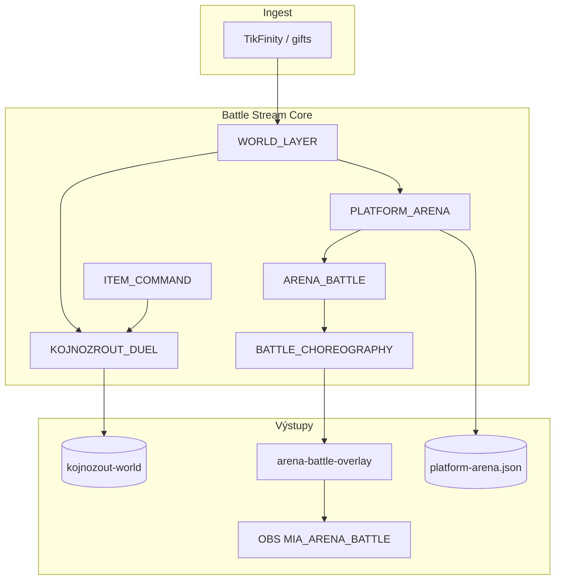

# Etapa 3H — Shrnutí (Battle vs kánon)

**Datum:** 2026-07-27  
**Status:** **Etapa 3H HOTOVO** (docs only, uncommitted OK)

---

## Počty z compliance matrix (70 pravidel BT-01…BT-70)

| Stav | Počet | Podíl |
|------|-------|-------|
| ✅ Shoda | 50 | 71 % |
| ⚠ Drift / částečná | 16 | 23 % |
| ❌ Rozpor | 0 | 0 % |
| ❓ Neověřeno | 4 | 6 % |

*⚠: BT-04,18,33,40,44,47,49,52,54,55,60,61,63,65,69,70. ❓: BT-19,42,67,68.*

---

## Verdikt

**Stream Core Battle** je **provozně funkční MVP** (duel bodový závod, platform arena s fázemi, choreografie, item boost, world-layer sync) — ale **není** plný Master Canon 0039 Battle Engine a **není** ověřený live paralelní 2-stream duel:

- Cross-stream duel model + routes + unit peer sync ✅  
- Platform arena 4 coin-žrouti + MVP announce→countdown→active + energy/interval + steal ✅  
- Choreografie respektuje feeding/sleep + poses ✅  
- Item use → `itemPower` v duelu ✅  
- Power bar / miaPoints (bez coins na HUD) ✅  
- Master 0039/0048 = **lab unwired** ⚠ (ne ❌)  
- Dva paralelní battle modely + dva inventáře ⚠  
- Live 2-stream duel / live arena vieweri / OBS ensure live = **❓ nikdy**  
- Live arena viz = **hist. R1-C 2026-07-26** (ne fresh)

**Žádný tvrdý rozpor (❌) proti Stream Core guardrails.**  
**Kritická mezera** = live dual-host (GAP-H01) — Decision later, ne auto-fix.

---

## Top drifty mapované na 5 uživatelských témat

1. **Deterministická logika** — scoring pure ✅; `Date.now` + item `Math.random` ⚠ (GAP-H08).  
2. **Ekonomika battle** — miaPoints race + steal + energy ✅; dual model duel↔arena ⚠ (GAP-H02); live vieweri ❓.  
3. **Fronty příkazů** — item FIFO + energy/interval gate ✅; ≠ Master Action Queue ⚠ (GAP-H04).  
4. **Návaznost na inventář** — batoh `item use` boost ✅; viewer-inventory paralelní stub ⚠ (GAP-H05).  
5. **Sync se subsystémy** — world layer gift→arena/duel ✅; 2-stream live + OBS ensure live ❓ (GAP-H01/H07).

---

## Co je silné (neměnit bez důvodu)

1. `MIA_KOJNOZROUT_DUEL.js` — čistý bodový závod + power bar + export/sync  
2. `MIA_PLATFORM_ARENA.js` — MVP fáze + energy/interval + steal (Phase 3)  
3. `MIA_ARENA_BATTLE.js` + `MIA_KOJ_BATTLE_CHOREOGRAPHY.js` — moves + vitals block  
4. `MIA_KOJ_ROSTER.js` + `forms/{platform}` — 4 coin-žrouti  
5. `MIA_WORLD_LAYER_RUNTIME.js` — gift → duel/arena/battle save  
6. `handleItemCommand` item use → `itemPower` v duelu  
7. Contracty: `phase3_game_layer`, `platform_arena`, `koj_battle_choreography`, `duel_cross_stream_sync` (fresh PASS 2026-07-27)

---

## Stream Core vs Master Canon

| | Stream Core (měřítko 3H) | Master Canon |
|--|--------------------------|--------------|
| Duel | `MIA_KOJNOZROUT_DUEL` body závod | Session/history types 0039 |
| Arena | `MIA_PLATFORM_ARENA` + MVP | Battle Engine řídí platform fight (0048) |
| Queue | energy+interval + item display | `enqueueBattleAction` lab |
| Damage | steal miaPoints | `calculateDamage` + seed stub |
| Status | produkční subset | 🟡 alignment — **ne** ❌ |

---

## Vztah k Etapa 3A–3G

| Dokument | Zaměření | Vztah k 3H |
|----------|----------|------------|
| **3A** | Gift tier / spam | Gift → arena activity / move trigger |
| **3B** | miaPoints / ledger | Vstup do power/skóre; konverze OUT |
| **3C** | Koj CARE / vitals | Feeding/sleep block choreografie IN |
| **3D** | OBS bootstrap | `obs:ensure-arena-battle` IN; bootstrap OUT |
| **3E** | Voice/TTS | Battle speech thin |
| **3F** | Overlay Runtime | Arena HTML poll; strip |
| **3G** | Persistence | arena/world duel JSON; durability OUT |

---

## Dopad na ostatní moduly



### Gift systém
```
Ovlivňuje: ANO (gift → arena activity / battle move / energy)
Neovlivňuje: tier/spam math (3A)
Vyžaduje nový audit: NE (při změně gift→arena map znovu BT-43,28)
```

### MIA body / economy
```
Ovlivňuje: ANO (miaPoints jako duel/arena power; steal)
Neovlivňuje: konverze 7.5 / ledger (3B)
Vyžaduje nový audit: NE (při změně power bar znovu BT-14,45 + 3B)
```

### Koj
```
Ovlivňuje: ANO (choreografie block feeding/sleep; item care mimo duel)
Neovlivňuje: full CARE/bowl (3C)
Vyžaduje nový audit: NE (při změně vitals block znovu BT-36,37 + 3C)
```

### Bowl
```
Ovlivňuje: ČÁSTEČNĚ (feeding pulse blokuje battle pose)
Neovlivňuje: fill %
Vyžaduje nový audit: NE
```

### Overlay
```
Ovlivňuje: ANO (arena-battle-overlay, power bar, pts)
Neovlivňuje: pick/pin speech (3F)
Vyžaduje nový audit: NE (live viz → BT-42)
```

### Voice / TTS
```
Ovlivňuje: ČÁSTEČNĚ (item/duel speech stringy)
Neovlivňuje: Edge TTS engine (3E)
Vyžaduje nový audit: NE
```

### OBS
```
Ovlivňuje: ANO (MIA_ARENA_BATTLE browser source)
Neovlivňuje: bootstrap/manifest (3D)
Vyžaduje nový audit: NE (live ensure → BT-67)
```

### Persistence
```
Ovlivňuje: ANO (platform-arena.json, world duel/backpack)
Neovlivňuje: bak/quarantine (3G hotovo)
Vyžaduje nový audit: NE
```

### Editor
```
Ovlivňuje: ČÁSTEČNĚ (forms/2D factory assets pro battle poses)
Neovlivňuje: editor UX deep
Vyžaduje nový audit: HOTOVO → docs/MIA_AUDIT_ETAPA_3I_EDITOR/
```

### Ingest
```
Ovlivňuje: ANO (eventType → duel/arena points přes world layer)
Neovlivňuje: TikFinity auth
Vyžaduje nový audit: NE
```

---

## Poslední ověření (povinná tabulka)

| Oblast | Stav | Poslední ověření |
|--------|------|------------------|
| phase3 MVP phases + energy | ✅ | fresh PASS 2026-07-27 |
| platform_arena 4 kojs + steal | ✅ | fresh PASS 2026-07-27 |
| choreography feeding/poses | ✅ | fresh PASS 2026-07-27 |
| duel export/sync unit | ✅ | fresh PASS 2026-07-27 |
| arena_battle_demo (+ ctx) | ✅ | fresh PASS 2026-07-27 |
| item use → itemPower (kód/contract) | ✅ | fresh code 2026-07-27 |
| Master 0039 wired v index | ⚠ | fresh — unwired |
| Dual inventář | ⚠ | fresh — dvě cesty |
| Live 2-stream duel | ❓ | **nikdy** |
| Live arena + vieweri | ❓ | **nikdy** |
| obs:ensure-arena-battle live | ❓ | **nikdy** |
| Arena overlay viz | ❓ | hist. R1-C 2026-07-26 (ne fresh) |
| Ops full preflight:fast celý | ❓ | **neběželo celé** v tomto docs běhu (jen battle subset) |

> Historický R1-C battle viz **nepovažovat** za fresh ověření live arena z 2026-07-27.

---

## Co je NEOVĚŘENO

| Oblast | Důkaz místo toho |
|--------|------------------|
| Paralelní duel 2 hosty + 2 OBS | Unit sync + GAP-H01 |
| Produkční arena s viewery | Demo + phase3 + GAP-H07 |
| OBS ensure proti live WebSocket | Script source + GAP-H07 |
| Bit-identical replay napříč restartem | Pure math + Date.now GAP-H08 |

---

## Artefakty Etapa 3H

| Soubor | Obsah |
|--------|--------|
| `00_SCOPE.md` | IN/OUT, Stream vs Master 0039/0048, handoffs |
| `01_CANON_RULES_EXTRACT.md` | 70 pravidel + GR-B01…08 |
| `02_COMPLIANCE_MATRIX.md` | 70 řádků BT-* + Poslední ověření |
| `03_GAPS.md` | 12 mezer (1 VYSOKÁ, 6 STŘEDNÍ, 3 NÍZKÁ, 2 INFO) |
| `04_TESTS_COVERAGE.md` | Fast / mimo / live + T-H01…08 |
| `05_SUMMARY.md` | Tento dokument |

---

## Etapa 3H HOTOVO

Audit shody **Battle (Stream Core)** s kánonem je **kompletní**.  
**Žádné změny aplikačního kódu** nebyly provedeny.  
Mezery jsou záznam pro **DECISION later**, ne auto-fix.

*Příští krok po 3I: **Etapa 4 Cross Audit** (3I Editor = `docs/MIA_AUDIT_ETAPA_3I_EDITOR/`).*

---

## Povinná souhrnná tabulka (audit standard)

| Kategorie | Počet |
|-----------|-------|
| Guardrails | 8 |
| Implementováno | 66 |
| Testováno | 48 |
| Chybí test | 22 |
| Drift | 16 |
| Rozpor | 0 |
| Riziko vysoké | 1 |
| Riziko střední | 6 |
| Riziko nízké | 3 |

**Poznámky k tabulce:**
- **Guardrails** = GR-B01…GR-B08 (8).
- **Implementováno** = 50 ✅ + 16 ⚠ (kód/partial existuje; ❓ live nepočítat jako chybějící implementaci).
- **Testováno** = ~48 z `04_TESTS_COVERAGE.md` (🟢 + relevantní 🟡).
- **Chybí test** = 70 − 48 = 22.
- **Drift** = 16 ⚠; **Rozpor** = 0.
- **Rizika** dle `03_GAPS.md`: 1 VYSOKÁ, 6 STŘEDNÍ, 3 NÍZKÁ (+ 2 INFO mimo tabulku rizik).
