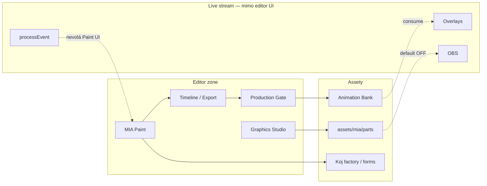

# Etapa 3I — Shrnutí (Editor vs kánon)

**Datum:** 2026-07-27  
**Status:** **Etapa 3I HOTOVO** (docs only, uncommitted OK)

---

## Počty z compliance matrix (68 pravidel ED-01…ED-68)

| Stav | Počet | Podíl |
|------|-------|-------|
| ✅ Shoda | 48 | 71 % |
| ⚠ Drift / částečná | 14 | 21 % |
| ❌ Rozpor | 0 | 0 % |
| ❓ Neověřeno | 6 | 9 % |

*⚠: ED-06,12,16,28,31,32,41,50,53,56,57,60,64,67. ❓: ED-21,33,39,43,55,59.*  
*Kontrola: 48+14+0+6 = 68.*

---

## Verdikt

**Editor / Graphics Studio / MIA Paint** je **zralý obsahový tooling** s hustými contracty (Paint + `graphics_body` + Animation Bank), ale **není** součástí live ingest a **není** plně samostatný offline produkt:

- Oddělení od `processEvent` / TikFinity ingest ✅  
- Paint HTTP+WS + bridge + plugins + Tauri scaffold ✅  
- Export timeline → Animation Bank + C1–C6 + production gate ✅  
- Body parts catalog **default OFF**; live avatar = `#miaHolo` ✅  
- OBS kompatibilita (catalog, preview, revive kód) ✅; **live revive/verify ❓**  
- Standalone: běží bez ingest, ale typicky potřebuje MIA HTTP; Tauri install **❓**  
- Bone / IK / AI Motion = **foundation** ⚠ (ne produkční mocap)  
- Shared `mia-paint-core` LipSync v delivery = coupling ⚠ (ne Paint UI v streamu)  
- Master Visual Rendering 0037 = aspirace ⚠  

**Žádný tvrdý rozpor (❌) proti Stream Core guardrails.**  
**Kritická maturita mezera** = očekávání „standalone Tauri offline“ vs realita (GAP-I01/I02) — Decision later, ne auto-fix.

---

## Top drifty mapované na 6 uživatelských témat

1. **Oddělení editoru od runtime** — Paint mimo `processEvent` ✅; shared LipSync v delivery ⚠ (GAP-I04).  
2. **Export pipeline** — paint→bank+C1–C6+gate ✅; live custom shot ❓; sound cues thin ⚠ (GAP-I05/I08).  
3. **Správa assetů** — parts/ + factory + identity/trueAlpha ✅; promote ops/gate disciplína ⚠ (GAP-I10).  
4. **Vazby na overlaye** — staging≠live, body OFF, `#miaHolo` ✅; T3+ moment hranice editor/live ⚠ (ED-41).  
5. **Kompatibilita s OBS** — catalog/preview/aliases ✅; live revive + verify layers ❓ (GAP-I06).  
6. **Standalone mimo MIA** — bez ingest ano; bez MIA serveru / Tauri install neúplné ⚠/❓ (GAP-I01/I02).

---

## Co je silné (neměnit bez důvodu)

1. **Hranice editor ≠ `processEvent`** — routes/admin + Etapa 2 flow  
2. **`bodyPartsCatalog` `defaultVisible: false`** — všechny `MIA_HEAD…FEET`  
3. **Production gate + staging≠live** — `productionGate.js`, 12w–12z  
4. **`export_paint_to_animation_bank` + C1–C6** — Phase 16 cameraId  
5. **MIA Paint bridge + WS + plugin host** — lab API stabilní  
6. **`graphics_body` runner (12g–14b)** — husté studio contracty ve FAST přes jeden entry  
7. **Koj 2D factory + paint koj-factory-export** — asset pipeline pro Koj/battle forms  
8. **Visual identity + true alpha** — cyan holo lock, body-parts build

---

## Stream Core vs Master / aspirational

| | Stream Core (měřítko 3I) | Master / aspirace |
|--|--------------------------|-------------------|
| Editor | Paint + Studio + Bank export | Visual Rendering 0037 plný |
| Live path | Editor **mimo** ingest | — |
| Bone/IK/AI motion | Phase 15 foundation | „Full mocap / AI director“ |
| Plugins | Paint plugins (grid, koj export) | Stream game plugin engine |
| Standalone | Shell + HTTP MIA | Fully offline desktop product |
| Status | produkční tooling subset | 🟡 alignment — **ne** ❌ |

---

## Vztah k Etapa 3A–3H

| Dokument | Zaměření | Vztah k 3I |
|----------|----------|------------|
| **3A** | Gift tier / spam | Bank gift resolve asset; rotace OUT |
| **3B** | miaPoints / ledger | No coins v editor/public |
| **3C** | Koj CARE | Factory moods / forms |
| **3D** | OBS bootstrap | Body OFF + preview; bootstrap OUT |
| **3E** | Voice/TTS | Shared lip helpers; TTS OUT |
| **3F** | Overlay Runtime | Body overlays OFF; pick/pin OUT |
| **3G** | Persistence | Paint autosave lab; bak OUT |
| **3H** | Battle | 2D factory / forms assets |

---

## Dopad na ostatní moduly



### Gift systém
```
Ovlivňuje: ANO (export/promote → bank → gift reaction art)
Neovlivňuje: tier/spam math (3A)
Vyžaduje nový audit: NE (při změně bank resolve znovu ED-55 + 3A)
```

### MIA body / economy
```
Ovlivňuje: NE (editor nevede ledger)
Neovlivňuje: konverze / coins guard (3B drží)
Vyžaduje nový audit: NE
```

### Koj
```
Ovlivňuje: ANO (2D factory / moods seed / forms art)
Neovlivňuje: CARE/bowl runtime (3C)
Vyžaduje nový audit: NE
```

### Bowl
```
Ovlivňuje: NE
Neovlivňuje: fill %
Vyžaduje nový audit: NE
```

### Overlay
```
Ovlivňuje: ANO (body overlays OFF; staging preview; speak faces art)
Neovlivňuje: pick/pin speech UX (3F)
Vyžaduje nový audit: NE (live body ON → 3D/3F + ED-35)
```

### Voice / TTS
```
Ovlivňuje: ČÁSTEČNĚ (shared lipTrack builders z paint-core)
Neovlivňuje: Edge TTS engine (3E)
Vyžaduje nový audit: NE (při přesunu lip lib → GAP-I04)
```

### OBS
```
Ovlivňuje: ANO (body catalog, preview, revive scripts)
Neovlivňuje: bootstrap/watchdog (3D)
Vyžaduje nový audit: NE (live revive → ED-39/43)
```

### Persistence
```
Ovlivňuje: ČÁSTEČNĚ (data/mia-paint autosave lab)
Neovlivňuje: bak/quarantine stream stores (3G)
Vyžaduje nový audit: NE
```

### Battle
```
Ovlivňuje: ČÁSTEČNĚ (forms/2D factory art)
Neovlivňuje: scoring/choreografie (3H hotovo)
Vyžaduje nový audit: NE
```

### Ingest
```
Ovlivňuje: NE (editor mimo processEvent)
Neovlivňuje: TikFinity auth
Vyžaduje nový audit: NE
```

---

## Poslední ověření (povinná tabulka)

| Oblast | Stav | Poslední ověření |
|--------|------|------------------|
| Editor ≠ processEvent | ✅ | fresh code 2026-07-27 |
| Paint routes/bridge/WS (source) | ✅ | fresh |
| Body defaultVisible false | ✅ | fresh catalog |
| Production gate + staging≠live | ✅ | fresh |
| Export + C1–C6 schema | ✅ | fresh phase16 source |
| Tauri scaffold contract existence | ✅ | fresh |
| Bone/IK foundation label | ⚠ | fresh |
| Standalone bez MIA HTTP | ⚠ | fresh README |
| Shared LipSync v delivery | ⚠ | fresh |
| Live AI quality | ❓ | **nikdy** |
| Tauri installer na PC | ❓ | **nikdy** |
| Live OBS revive/verify | ❓ | **nikdy** |
| Live gift camera/shot resolve | ❓ | **nikdy** |
| Whisper live | ❓ | **nikdy** |
| Contract suite re-run | ❓ | **neběželo** (docs-only) |

> Capability/Etapa 3 historické PASS **nepovažovat** za fresh re-run z 2026-07-27.

---

## Co je NEOVĚŘENO

| Oblast | Důkaz místo toho |
|--------|------------------|
| Installed Tauri + Ink na operator | Scaffold + GAP-I02 |
| Plný offline Paint bez MIA | Offline notices + GAP-I01 |
| Live AI / Whisper kvalita | Contracts existence + GAP-I09 |
| Live custom timeline → gift shot | phase16 unit + GAP-I05 |
| Live OBS body revive/verify | 13c code + GAP-I06 |
| Re-run všech editor contractů dnes | Source review only |

---

## Artefakty Etapa 3I

| Soubor | Obsah |
|--------|--------|
| `00_SCOPE.md` | IN/OUT, Stream vs Master, handoffs, next=Etapa 4 |
| `01_CANON_RULES_EXTRACT.md` | 68 pravidel + GR-E01…08 |
| `02_COMPLIANCE_MATRIX.md` | 68 řádků ED-* + Poslední ověření |
| `03_GAPS.md` | 13 mezer (0 VYSOKÁ, 6 STŘEDNÍ, 4 NÍZKÁ, 3 INFO) |
| `04_TESTS_COVERAGE.md` | Fast / mimo / live + T-I01…06 |
| `05_SUMMARY.md` | Tento dokument |

---

## Etapa 3I HOTOVO

Audit shody **Editor (Stream Core tooling)** s kánonem je **kompletní**.  
**Žádné změny aplikačního kódu** nebyly provedeny.  
Mezery jsou záznam pro **DECISION later**, ne auto-fix.

Capability audity **3A–3I jsou uzavřené** (Stream Core).  

*Příští krok: **Etapa 4 Cross Audit** — **HOTOVO** 2026-07-28: `docs/MIA_AUDIT_ETAPA_4_CROSS/` (62 XC-*, 0 ❌; capstone collaboration). Decision later board / live R1-D = po verdiktu uživatele; Etapa 5 neauto-start.*

---

## Povinná souhrnná tabulka (audit standard)

| Kategorie | Počet |
|-----------|-------|
| Guardrails | 8 |
| Implementováno | 62 |
| Testováno | 50 |
| Chybí test | 18 |
| Drift | 14 |
| Rozpor | 0 |
| Riziko vysoké | 0 |
| Riziko střední | 6 |
| Riziko nízké | 4 |

**Poznámky k tabulce:**
- **Guardrails** = GR-E01…GR-E08 (8).
- **Implementováno** = 48 ✅ + 14 ⚠ (kód/partial existuje; ❓ live nepočítat jako chybějící implementaci).
- **Testováno** = ~50 z `04_TESTS_COVERAGE.md` (🟢 + relevantní 🟡).
- **Chybí test** = 68 − 50 = 18.
- **Drift** = 14 ⚠; **Rozpor** = 0.
- **Rizika** dle `03_GAPS.md`: 0 VYSOKÁ, 6 STŘEDNÍ, 4 NÍZKÁ (+ 3 INFO mimo tabulku rizik).
