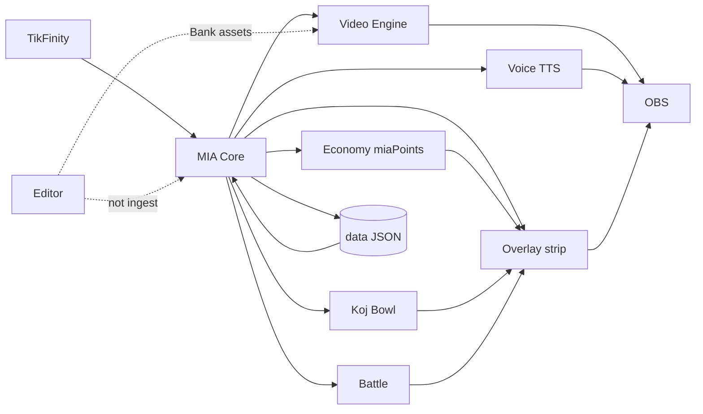

# Etapa 4 — Capstone Summary (Cross Audit)

**Datum:** 2026-07-28  
**Status:** **Etapa 4 HOTOVO** (docs only, uncommitted OK)  
**Typ:** Module collaboration / E2E chains — **ne** další izolovaný module audit

---

## Počty z compliance matrix (62 pravidel XC-01…XC-62)

| Stav | Počet | Podíl |
|------|-------|-------|
| ✅ Shoda | 36 | 58 % |
| ⚠ Drift / částečná | 12 | 19 % |
| ❌ Rozpor | 0 | 0 % |
| ❓ Neověřeno | 14 | 23 % |

*⚠: XC-06,12,14,21,25,29,31,36,53,55,56,61. ❓: XC-18,19,20,27,38,39,42,44,47,48,49,57,59,62.*  
*Kontrola: 36+12+0+14 = 62.*

---

## Capstone verdikt

**Stream Core architektura spolupráce je stabilní v guardrails** (TikFinity→MIA→OBS, miaPoints-only public overlay, dual voice OFF, business logika v MIA, body parts OFF, editor mimo ingest):

- Handoffy gift→economy→strip, music gift→TTS suppress, gift→world layer→battle pts, boot hydrate Koj/runtime, public poll bez coins — **drží** (kód + prior 3A–3I + spot-check 2026-07-28).  
- **Žádný nový tvrdý ❌** proti cross guardrails.  
- Zbývající dluh je **rozhodovací a ověřovací**: spam T4 shadow, bowl 95/100, persist bak/multi-file, live 2-stream, fresh live R1-D (hist. R1-C ≠ fresh).  

**Připravenost na stabilizační fázi:** **ANO s podmínkami** — capability + canon series 1/2/3A–3I kompletní; Cross Audit uzavírá mapu spolupráce. Stabilizace = **Decision later workshop** + volitelný **live R1-D**, ne slepé kódování Master Canon.

**Není** „všechno ověřeno live dnes“ a **není** Master Recovery/Battle Engine wired — to je záměrný Stream Core subset (🟡 aspirace, ne ❌).

---

## Scenario scorecard (S01–S12)

| ID | Scénář | Status | Poslední ověření |
|----|--------|--------|------------------|
| S01 | Gift → Economy (miaPoints) → Overlay public strip | ✅ (⚠ spam T4 chain) | strip fresh 2026-07-28; T4 drift cite 3A/3B |
| S02 | Gift → Video/OBS media + Overlay HUD | ⚠/❓ | unit 3A; live viz **hist. R1-C 2026-07-26** |
| S03 | Gift → Voice suppress / bubble vs TTS | ✅ (flush ⚠) | speaker_routing 2026-07-27; flush mimo fast |
| S04 | Gift/Support → Koj/Bowl → Overlay/OBS | ⚠ | CARE/display ✅; bowl 95/100 ⚠; Trust ⚠ |
| S05 | Gift → Battle → Overlay | ✅ unit / ❓ live dual | world layer+phase3 2026-07-27; 2-stream **nikdy** |
| S06 | Chat/Speaker → Voice → bubble hide → MIA_VOICE | ✅ policy / ❓ live audio | 3E/3F; anti-echo hist. R1-C |
| S07 | Overlay poll ← MIA (no coins) | ✅ | fresh strip 2026-07-28 |
| S08 | OBS reconnect / voice revive (3D+3E) | ❓ | unit WD/bootstrap ✅; live reconnect/revive **nikdy** fresh |
| S09 | Persistence → restart → hydrate | ✅ / ⚠ multi-file | SEED_CTX 3G ✅; G02/G04 ⚠ |
| S10 | Crash/kill mid-write → recovery | ❓ | **nikdy**; soft-fail bez `.bak` ⚠ |
| S11 | Editor export → Bank → gift resolve | ✅ unit / ❓ live | 3I export ✅; live shot **nikdy** |
| S12 | Host/Away / dual stream | ⚠ / ❓ | Away stub; dual-host **nikdy** |

---

## Povinná souhrnná tabulka (audit standard)

| Kategorie | Počet |
|-----------|-------|
| Guardrails | 8 |
| Implementováno | 48 |
| Testováno | 38 |
| Chybí test | 24 |
| Drift | 12 |
| Rozpor | 0 |
| Riziko vysoké | 4 |
| Riziko střední | 9 |
| Riziko nízké | 1 |

**Poznámky k tabulce:**
- **Guardrails** = GR-X01…GR-X08 (8).  
- **Implementováno** = 36 ✅ + 12 ⚠ (kód/partial existuje; ❓ live ≠ chybějící implementace).  
- **Testováno** = 38 z `04_TESTS_COVERAGE.md` (🟢 + relevantní 🟡 řezy řetězců).  
- **Chybí test** = 62 − 38 = 24.  
- **Drift** = 12 ⚠; **Rozpor** = 0.  
- **Rizika** dle `03_GAPS.md` GAP-X*: 4 VYSOKÁ, 9 STŘEDNÍ, 1 NÍZKÁ (+ INFO X15 mimo skóre rizik).

---

## Consolidated Decision later — top strategické (z TOP 15)

1. **Persist durability** — `.bak` / quarantine / multi-file / kill mid-write (**3G** G01–G03 → GAP-X03)  
2. **Spam T4 HUD vs shadow T3 video** (**3A+3B** → GAP-X01)  
3. **Bowl 95 % viz vs 100 % T4** (**3C+3A** → GAP-X02)  
4. **Live 2-stream duel** (**3H** H01 → GAP-X04)  
5. **Fresh live R1-D** audio/viz/reconnect/burst (**3D+3E+3F** → GAP-X05)  
6. **Trust CARE** (**3C** C02) · **Dual battle models** (**3H** H02) · **Away stub** (**3D/3F**)  
7. Rotace: cross-tier contract + optional persist index (**3A/3G**)  
8. Editor standalone / live shot scope (**3I**)  
9. Docs: dual voice do `mia-guardrails.mdc` (**3E** E05)  
10. Master lab wire = roadmap INFO, ne blok Stream Core

Plný board: `03_GAPS.md` (15 řádků).

---

## Poslední ověření (povinná tabulka)

| Oblast | Stav | Poslední ověření |
|--------|------|------------------|
| TikFinity→MIA→OBS handoff | ✅ | fresh wiring spot 2026-07-28 |
| Public strip miaPoints only | ✅ | fresh `stripValueFieldsForPublic` 2026-07-28 |
| Dual voice default OFF | ✅ | 3E + env spot 2026-07-28 |
| rotationIndexByTier (kód) | ✅/⚠ | fresh code; cross-tier test thin |
| Music gift TTS suppress | ✅ | 3E speaker_routing 2026-07-27 |
| Gift→world layer→battle pts | ✅ | 3H + WORLD_LAYER spot 2026-07-28 |
| Boot hydrate Koj/runtime | ✅ | 3G seed_ctx 2026-07-27 |
| Editor ≠ processEvent | ✅ | 3I 2026-07-27 |
| Spam T4 shadow cap | ⚠ | cite 3A/3B (Decision later) |
| Bowl 95/100 | ⚠ | cite 3C |
| `.bak` / multi-file / mid-write | ⚠/❓ | 3G; kill **nikdy** |
| Live gift/speech/combo viz | ❓ | hist. R1-C **2026-07-26** |
| Live anti-echo / MIA_VOICE | ❓ | hist. R1-C Audio **2026-07-26** |
| OBS reconnect / revive live | ❓ | **nikdy** fresh |
| Live 2-stream duel | ❓ | **nikdy** |
| Live editor gift shot | ❓ | **nikdy** |
| `preflight:fast` celý tento běh | ❓ | **neběželo** (docs-only) |

> Hist. R1-C **nepovažovat** za fresh ověření z 2026-07-28. Prior 3* PASS **2026-07-27** = modulová shoda, ne re-run dnes.

---

## Co je silné (cross-architecture) — neměnit bez důvodu

1. **Jednosměrný tok** TikFinity → MIA pipeline → Delivery → Overlay/Video/TTS → OBS poll/media  
2. **`stripValueFieldsForPublic`** jako tvrdá hranice economy↔presentation (reuse i engine2 stubs)  
3. **Speaker routing policy** — dual OFF, music→bubble, voice-first hide (3E↔3F)  
4. **World layer** gift/support → duel/arena v miaPoints (3A/3B↔3H)  
5. **OBS live manifest + post-connect chain** — render-only disciplína (3D)  
6. **Boot `composeKojSeed` / SEED_CTX** — Koj+runtime hydrate bez wipe (3G)  
7. **Editor mimo ingest** + production gate + body default OFF (3I↔3D/3F)  
8. **Per-tier `rotationIndexByTier`** v Video Engine (guardrail za běhu)  
9. **Husté unit/contract řezy** napříč 3A–3I ve `preflight:fast` (i když chain e2e thin)  
10. **Metodika Poslední ověření** napříč sérií — odděluje kód / hist live / nikdy

---

## Stream Core vs Master Canon (capstone)

| | Stream Core (měřítko Etapa 4) | Master / aspirace |
|--|------------------------------|-------------------|
| E2E path | Ingest→shadow→delivery→OBS | Full Event Store / Recovery Manager |
| Economy | miaPoints + strip | — |
| Battle | Duel + Platform Arena MVP | Battle Engine 0039 wired |
| Voice | Edge + single MIA_VOICE | Speech Engine 0035 analytics |
| Persist | data JSON + soft-fail | 0065/0066/0075 lab |
| Editor | Paint→Bank tooling | Visual Rendering 0037 full |
| Status | **produkční subset spolupracuje** | 🟡 alignment — **ne** ❌ |

---

## Dopad: Cross Audit nevlastní moduly

| Modul | SoT audit | Cross role |
|-------|-----------|------------|
| Gifts | **3A** | S01–S04 handoffy |
| Economy | **3B** | strip / pts |
| Koj | **3C** | bowl/CARE display |
| OBS | **3D** | S02/S08 transport |
| Voice | **3E** | S03/S06 |
| Overlay | **3F** | S01/S07 HUD |
| Persist | **3G** | S09/S10 |
| Battle | **3H** | S05/S12 |
| Editor | **3I** | S11 |

Při změně vnitřností → aktualizuj **modulový** audit; Cross jen pokud se změní **hranice** handoffu.

---

## Co je ready pro stabilizační fázi

| Ready | Podmínka |
|-------|----------|
| Architektura handoffů guardrails | ✅ bez dalšího izolovaného module auditu |
| Decision board (TOP 15) | ✅ připraven v `03_GAPS.md` |
| Unit/contract safety net | ✅ existuje (fast) — chain gaps známy |
| Live confidence | ⚠ spoléhá na hist. R1-C — doporučen R1-D |
| Persist durability product decision | ⚠ nutné **před** tvrzením „crash-safe“ |
| Master Canon wire | ❌ ne teď (INFO aspirace) |

---

## Next steps (volby po verdiktu uživatele) — **neauto-start**

1. **Decision board workshop** — projít TOP 15; označit Accept / Fix later / Change canon  
2. **Live R1-D** — fresh session: gift HUD, voice anti-echo, reconnect, burst (GAP-X05)  
3. **Selektivní fast promotions** — T-X01…T-X06 (docs návrh v `04_TESTS`)  
4. **Etapa 5?** — jen pokud uživatel explicitně otevře development phase; **tento pack Etapa 5 nezačíná**

---

## Artefakty Etapa 4

| Soubor | Obsah |
|--------|--------|
| `00_SCOPE.md` | Co Cross je/není; S01–S12; zdroje 1/2/3A–3I |
| `01_CROSS_CONTRACTS.md` | 62× XC-* + GR-X01…08 |
| `02_COMPLIANCE_MATRIX.md` | 62 řádků + Poslední ověření |
| `03_GAPS.md` | GAP-X01…15 + TOP 15 Decision board |
| `04_TESTS_COVERAGE.md` | Chain coverage + T-X* |
| `05_SUMMARY.md` | Tento dokument |

---

## Etapa 4 HOTOVO

**Cross Audit (Module Collaboration)** je **kompletní**.  
**Žádné změny aplikačního kódu** nebyly provedeny.  
Capability série **1, 2, 3A–3I** + **Etapa 4** = uzavřená audit řada před stabilizací.  
Mezery = **Decision later**, ne auto-fix.

**Uživatelský verdikt:** ✅ Etapa 4 uzavřená (2026-07-28) — po přečtení celého ZIPu.

**Doplněk údržby:** tabulka **Vlastníci cross-kontraktů** + mapa modul→XC v `01_CROSS_CONTRACTS.md` (po verdiktu, na žádost o ownership mapu).

*Příští krok (stabilizace, ne nové features):*
1. **Decision Later workshop** — [`docs/MIA_DECISION_LATER_WORKSHOP.md`](../MIA_DECISION_LATER_WORKSHOP.md) ✅ připraven (2026-07-28)
2. **R1-D Live** — scénáře označené ❓ (po checkboxech workshopu)
3. Teprve potom **Stream Core Lock**
