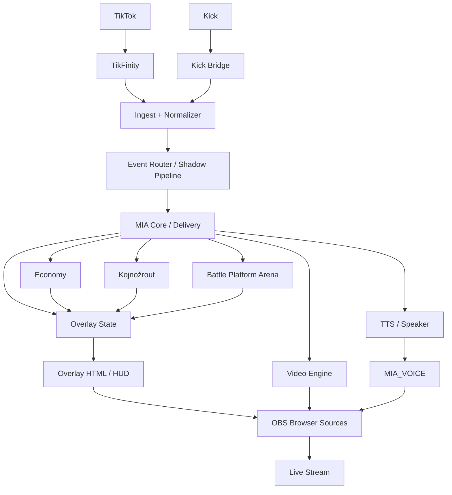

# MIA — Full System E2E Audit

**Datum:** 2026-07-28  
**Typ:** Kompletní mapa systému end-to-end (docs only)  
**Pravidla:** Žádný nový kód · žádné nové funkce · žádný Engine 2.0 branch · žádný live runtime v tomto kroku  

**Vztah k R1-D:** Tento dokument = **systémová mapa + rizika**.  
Oficiální live ověření řetězce = operátorův **R1-D Live** (`docs/MIA_R1D_LIVE_CHECKLIST.md`).  
Hist. R1-C PASS 2026-07-26 **není** fresh důkaz.

**Zdroje:** Etapa 1–2, 3A–3I, Etapa 4 Cross, Decision Later Workshop, Release Candidate R1.

**Owner (projekt):** Váša Špíňák — Project Owner / Operator  
**Audit SoT (technický detail):** příslušná etapa 3A–3I / XC

---

## 0. Účel a status

| Otázka | Odpověď |
|--------|---------|
| Je architektura popsaná? | ✅ Ano (1–4 + tento doc) |
| Jsou unit/contract testy zelené? | ✅ `preflight:fast` 164/164 (2026-07-28) |
| Je celý řetězec ověřen live E2E dnes? | ⏳ **Ne** — čeká R1-D RESULT |
| Největší riziko teď | Integrace za běhu (live), ne chybějící modul |

**Legenda statusu**

| Symbol | Význam |
|--------|--------|
| ✅ | Implementováno + contract/fresh code OK |
| ⚠ | Drift / Decision later (CHANGE-align atd.) |
| ❓ | Chybí fresh live důkaz |
| ❌ | Rozpor s guardrails (v sérii 0) |

---

## Výsledná mapa systému

```text
TikTok / Kick
      ↓
TikFinity / Kick bridge
      ↓
Ingest (/ingest) + Normalizer
      ↓
Event Router / Shadow Pipeline
      ↓
MIA Core (behavior / delivery)
      ├→ Economy (miaPoints, gift map, combo/spam)
      ├→ Kojnožrout (vitals, bowl, CARE)
      ├→ Battle (Platform Arena = SoT; duel = po Lock)
      ├→ Overlay state (public strip)
      └→ TTS / Speaker routing
            ↓
      Renderer (HTML overlays + video engine)
            ↓
      OBS (browser / media / MIA_VOICE)
            ↓
      Stream (TikTok/Kick výstup)
```



---

## 1. Ingest

| Modul | Owner | Status | Test Exists | Last Verified | Risk | Missing |
|-------|-------|--------|-------------|---------------|------|---------|
| TikTok via TikFinity | Váša Špíňák | ✅ | 🟢 ingest/smoke, live_smoke | code 2026-07-28; live **R1-D** | Medium | Fresh live E2E |
| Kick bridge | Váša Špíňák | ✅ | 🟢 kick_chat_reply, env_wiring | contract 2026-07-28 | Medium | Live Kick session |
| Normalizer | Váša Špíňák / Etapa 2 | ✅ | 🟢 phase1_event_normalizer, event_pipeline | 2026-07-28 | Low | — |
| Event Router / Shadow pipeline | Váša Špíňák / 3A | ✅ | 🟢 shadow_pipeline_integration | 2026-07-28 | Low | — |
| Ingest secret / localhost | Váša Špíňák | ✅ | 🟢 ingest_contract_smoke | 2026-07-28 | Low | Ops check na produkci |

**Řetězec:** `TikTok → TikFinity → /ingest → normalize → shadow/pipeline`

**Slabé místo:** Live ingest pod zátěží (burst gift+chat) = R1-D / extended.

---

## 2. Economy

| Modul | Owner | Status | Test Exists | Last Verified | Risk | Missing |
|-------|-------|--------|-------------|---------------|------|---------|
| miaPoints konverze | Váša Špíňák / **3B** | ✅ | 🟢 gift_runtime, economy config | 2026-07-28 | Low | — |
| Public strip (no coins) | Váša Špíňák / **3B+3F** | ✅ | 🟢 overlay_public_response, koj_public | fresh 2026-07-28 | Low | Admin spot-check live |
| Gift Mapping (`shared/gifts/`) | Váša Špíňák / **3A** | ✅ | 🟢 gift_map_contract | 2026-07-28 | Low | — |
| Combo moments | Váša Špíňák / **3A** | ✅ | 🟢 phase2_combo, graphics_r1 | unit ✅; live **hist. R1-C** | Medium | Fresh live R1D-02 |
| Spam wave HUD | Váša Špíňák / **3A** | ⚠ | 🟢 spam_session | code OK | **High** | **DL-01 CHANGE-align** HUD↔video (Před Lock) |
| Bowl fill % | Váša Špíňák / **3A+3C** | ⚠ | 🟢 koj/bowl contracts | 2026-07-27 | **High** | **DL-02 CHANGE-align** viz=trigger |

**Slabé místo:** Spam T4 vs shadow T3; bowl 95 vs 100 — rozhodnutí CHANGE-align, implementace Před Lock.

---

## 3. Runtime

| Modul | Owner | Status | Test Exists | Last Verified | Risk | Missing |
|-------|-------|--------|-------------|---------------|------|---------|
| Behavior / Delivery runtime | Váša Špíňák | ✅ | 🟢 delivery_runtime | 2026-07-28 | Low | — |
| Kojnožrout vitals / mood | Váša Špíňák / **3C** | ✅ | 🟢 vitals, mood, runtime | 2026-07-27 | Medium | Live R1D-05 |
| CARE / bond | Váša Špíňák / **3C** | ⚠ | 🟢 care contracts | 2026-07-27 | Medium | **DL-03** kánon bond-only (docs Před Lock) |
| Inventory / batoh | Váša Špíňák / **3H+3G** | ⚠ | 🟢 phase3 | 2026-07-27 | Medium | Dual inventář stub (Decision later) |
| Battle **Platform Arena** (SoT) | Váša Špíňák / **3H** | ✅ | 🟢 platform_arena, phase3 | 2026-07-27 | Medium | Live R1D-06 |
| Cross-stream Duel | Váša Špíňák / **3H** | ❓ | 🟢 duel_cross_stream_sync | unit ✅ | High* | Live **nikdy**; **Po Lock** (DL-08) |

\*High jen pro multi-host produkt; single-host RC = Low.

**Slabé místo:** Live Platform Arena spot; 2-stream mimo jádro.

---

## 4. Graphics

| Modul | Owner | Status | Test Exists | Last Verified | Risk | Missing |
|-------|-------|--------|-------------|---------------|------|---------|
| Overlay HTML poll | Váša Špíňák / **3F** | ✅ | 🟢 overlay_* | 2026-07-28 | Low | Fresh viz R1-D |
| Speech overlay | Váša Špíňák / **3F** | ✅ | 🟢 overlay_layout (🟡 mimo fast) | hist. R1-C speech 36 | Medium | Fresh live |
| Gift overlay (v37) | Váša Špíňák / **3A+3F** | ✅ | 🟢 graphics_r1 | hist. R1-C | Medium | Fresh live |
| Combo/spam HUD | Váša Špíňák / **3F** | ✅ | 🟢 graphics_r1 | hist. R1-C | Medium | + DL-01 align |
| PNG / sprites Koj | Váša Špíňák / **3C** | ✅ | 🟢 sprite_alpha, runtime | 2026-07-27 | Low | — |
| Browser Sources catalog | Váša Špíňák / **3D** | ✅ | 🟢 obs_live_manifest | 2026-07-27 | Low | — |
| Body parts live | Váša Špíňák / **3D+3I** | ✅ OFF | 🟢 graphics_body | 2026-07-27 | Low | Musí zůstat default OFF |

**Slabé místo:** Fresh live vizuál (ne unit).

---

## 5. OBS

| Modul | Owner | Status | Test Exists | Last Verified | Risk | Missing |
|-------|-------|--------|-------------|---------------|------|---------|
| WebSocket / bootstrap | Váša Špíňák / **3D** | ✅ | 🟢 obs_bootstrap | unit ✅ | Medium | Live reconnect **nikdy** fresh |
| Scene / post-connect | Váša Špíňák / **3D** | ✅ | 🟢 obs_post_connect | 2026-07-28 | Medium | Live R1D-09 |
| Media slots T1–T5 | Váša Špíňák / **3D+3A** | ✅ | 🟢 video/obs contracts | hist. R1-C | Medium | Fresh R1D-02 |
| Browser sources | Váša Špíňák / **3D** | ✅ | 🟢 obs_overlay_sync, manifest | 2026-07-27 | Low | — |
| Voice source `MIA_VOICE` | Váša Špíňák / **3D+3E** | ✅ | 🟢 ensure-voice scripts | hist. R1-C audio | Medium | Fresh revive R1D-09 |
| Watchdog relaunch | Váša Špíňák / **3D** | ✅ | 🟡 obs_watchdog | unit | Medium | Live kill OBS |

**Slabé místo:** Reconnect / revive live (R1D-09).

---

## 6. Audio

| Modul | Owner | Status | Test Exists | Last Verified | Risk | Missing |
|-------|-------|--------|-------------|---------------|------|---------|
| Edge TTS | Váša Špíňák / **3E** | ✅ | 🟢 tts/voice smokes | 2026-07-27 | Medium | Edge outage fallback |
| Speaker routing | Váša Špíňák / **3E** | ✅ | 🟢 speaker_routing | 2026-07-27 | Low | — |
| `MIA_VOICE` single sink | Váša Špíňák / **3E** | ✅ | 🟢 + docs | hist. R1-C | Medium | Fresh anti-echo |
| Anti-echo / Desktop mute | Váša Špíňák / **3E** | ❓ | partial | hist. R1-C | Medium | Fresh R1D-04 |
| Music gift → bubble, TTS off | Váša Špíňák / **3E** | ✅ | 🟢 speaker_routing | 2026-07-27 | Low | Live R1D-03 |
| Dual voice default OFF | Váša Špíňák / **3E** | ✅ | runtime + guardrails | 2026-07-28 | Low | — |
| Flush overlay po TTS | Váša Špíňák / **3E+3F** | ⚠ | 🟡 mimo fast | code OK | Medium | Zařadit do fast (Před Lock) |

**Slabé místo:** Fresh anti-echo pod zátěží.

---

## 7. Persistence

| Modul | Owner | Status | Test Exists | Last Verified | Risk | Missing |
|-------|-------|--------|-------------|---------------|------|---------|
| Save / hydrate Koj+runtime | Váša Špíňák / **3G** | ✅ | 🟢 phase1_runtime_state, seed_ctx | 2026-07-27 | Medium | Live R1D-07 |
| Soft-fail corrupt JSON | Váša Špíňák / **3G** | ✅ | partial | 2026-07-27 | Medium | Dedicated corrupt contract |
| `.bak` / quarantine / last-good | Váša Špíňák / **3G** | ⚠ chybí | — | nikdy | **High** | **DL-09** Před Lock po chaos |
| Multi-file konzistence | Váša Špíňák / **3G** | ⚠ | — | nikdy e2e | **High** | Debounce sync |
| Atomic write (runtime-state) | Váša Špíňák / **3G** | ✅ partial | — | 2026-07-27 | Medium | Unify Koj/economy |
| Restart soft | Váša Špíňák | ✅ | contracts | unit | Medium | Live R1D-07 |
| Chaos kill mid-write | Váša Špíňák | ❓ | — | **nikdy** | **High** | R1D-08 |

**Slabé místo:** Durability (bak + chaos) — největší technický dluh Stream Core.

---

## 8. Public API

| Modul | Owner | Status | Test Exists | Last Verified | Risk | Missing |
|-------|-------|--------|-------------|---------------|------|---------|
| `/overlay-state` | Váša Špíňák / **3F** | ✅ | 🟢 overlay_public_response | fresh 2026-07-28 | Low | — |
| `stripValueFieldsForPublic` | Váša Špíňák / **3B** | ✅ | 🟢 | fresh 2026-07-28 | Low | — |
| Guardrails (coins, OBS render, dual OFF, rotace) | Váša Špíňák | ✅ | docs + contracts | 2026-07-28 | Low | — |
| No coin leak public | Váša Špíňák | ✅ | 🟢 | fresh 2026-07-28 | Low | Live admin vs public spot |
| Engine2 stub OFF | Váša Špíňák | ✅ | 🟢 engine2_* | 2026-07-28 | Low | Nesmí se omylem zapnout na RC |

---

## 9. Performance

| Modul | Owner | Status | Test Exists | Last Verified | Risk | Missing |
|-------|-------|--------|-------------|---------------|------|---------|
| FPS overlay/OBS | Váša Špíňák | ❓ | — | hist. R1-C subjektivní | Medium | Měření v R1-D |
| Memory / leak | Váša Špíňák | ❓ | — | nikdy systematicky | Medium | Dlouhý stream profil |
| CPU (TTS+video+OBS) | Váša Špíňák | ❓ | — | hist. R1-C | Medium | Live pod zátěží |
| Crash recovery MIA | Váša Špíňák / **3G** | ❓ | soft soft-fail | nikdy kill e2e | **High** | R1D-08 |
| Crash recovery OBS | Váša Špíňák / **3D** | ❓ | unit WD | nikdy live | Medium | R1D-09 |

**Slabé místo:** Chybí kvantitativní performance baseline — doplnit poznámkami z R1-D.

---

## 10. Souhrnná rizika (priorita)

| # | Riziko | Oblast | Gate |
|---|--------|--------|------|
| 1 | Celý řetězec bez fresh live E2E | Cross | **R1-D Live** (operátor) |
| 2 | Persist bez bak / chaos | Persistence | R1D-08 + DL-09 Před Lock |
| 3 | Spam T4 HUD vs video | Economy | DL-01 Před Lock |
| 4 | Bowl 95 vs 100 | Economy/Koj | DL-02 Před Lock |
| 5 | Anti-echo / reconnect fresh | Audio/OBS | R1D-04 / R1D-09 |
| 6 | 2-stream duel | Battle | Po Lock (mimo RC) |

---

## 11. Mapování na R1-D scénáře

| E2E oblast | R1-D ID |
|------------|---------|
| Ingest + Economy strip | R1D-01 |
| Gift video + HUD | R1D-02 |
| Music gift audio policy | R1D-03 |
| TTS + anti-echo | R1D-04 |
| Koj / Bowl | R1D-05 |
| Platform Arena | R1D-06 |
| Restart hydrate | R1D-07 |
| Chaos kill | R1D-08 |
| OBS reconnect / voice | R1D-09 |

---

## 12. Co tento audit **není**

- Není náhrada R1-D Live RESULT.  
- Není Engine 2.0 design.  
- Není implementační backlog (to je Decision Workshop + Deviation Log po R1-D).  
- Nespouští runtime.

---

## 13. Stav dokumentu

| Pole | Hodnota |
|------|---------|
| Typ | Full System E2E Audit (mapa) |
| Kód změněn | **Ne** |
| Live E2E | ⏳ čeká R1-D RESULT |
| Další krok operátora | Provést R1-D Live · poslat RESULT |
| Další krok Cursor | Po RESULT: zápis Actual/Evidence/Deviation · Recommendation · Lock jen po potvrzení |

---

## Zdroje

| Dokument | Role |
|----------|------|
| `docs/MIA_AUDIT_ETAPA_4_CROSS/` | Cross contracts + scenario scorecard |
| `docs/MIA_DECISION_LATER_WORKSHOP.md` | DL-01…15, Exit Criteria CLOSED |
| `docs/MIA_R1D_LIVE_CHECKLIST.md` | Live gate R1D-01…09 |
| `docs/MIA_RELEASE_CANDIDATE_R1.md` | RC READY · R1-D LIVE: GO |
| `docs/MIA_AUDIT_ETAPA_3A_GIFTS/` … `3I_EDITOR/` | Modul SoT |
