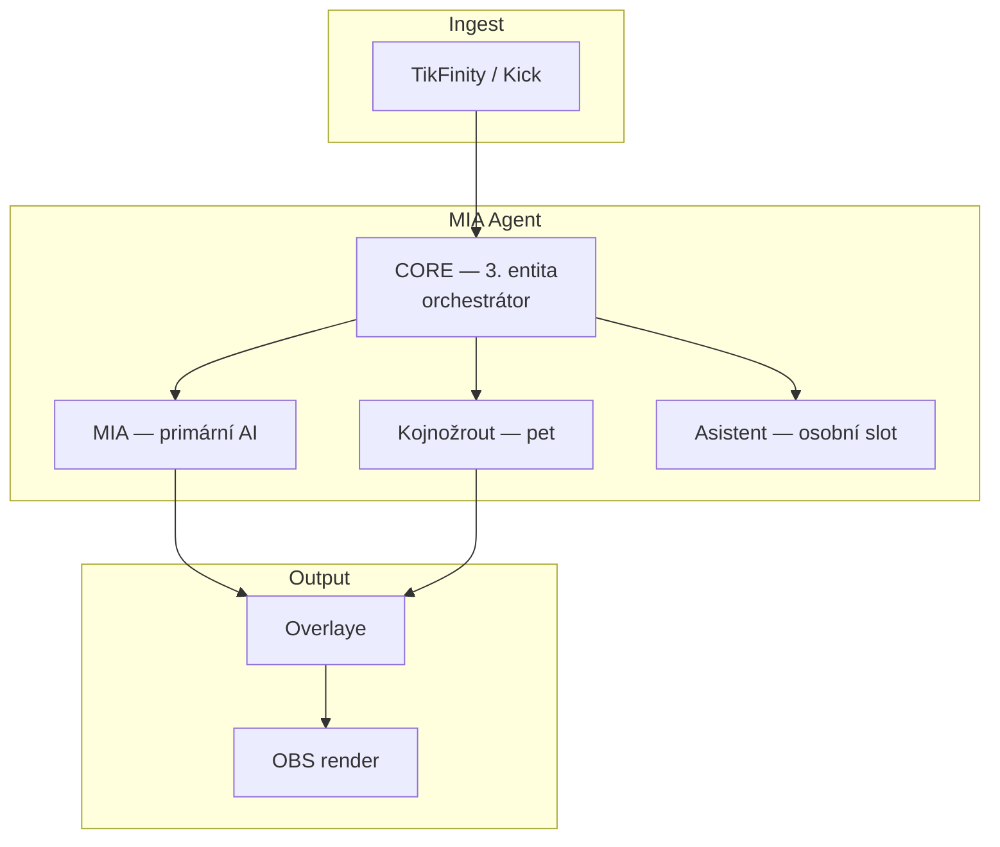

# MIA Multi-Agent Ecosystem

Jeden Node runtime (`index.js`) hostuje **více AI entit** v koordinovaném ekosystému.

## Entity model (kánon §2)



| Agent | ID | Veřejně mluví | Domény |
|-------|-----|---------------|--------|
| **CORE** | `core` | ne | routing, fronta, diagnostika |
| **MIA** | `mia` | ano | host, support, share, community |
| **Kojnožrout** | `kojnozout` | ano | CARE, support doplňky, duel |
| **Asistent** | `assistant` | ne (zatím) | osobní asistence mimo stream → fallback MIA |

## Runtime tok

```
POST /ingest
  → normalize
  → kojnozout vitals + world layer
  → shadow pipeline
      → decision engine
      → support reaction policy (gift lane)
      → ecosystem orchestrator (multi-agent plán)   ← NOVĚ
      → action builder (primary + companion overlay)
  → overlay / video execution
```

Modul: `scripts/MIA_ECOSYSTEM_ORCHESTRATOR.js`

## Domény

| Doména | Primární agent | Kdy |
|--------|----------------|-----|
| `SUPPORT` | Kojnožrout (+ MIA companion) | Gifty — **zachovává** existující support policy |
| `SHARE` | MIA (+ Koj companion) | SHARE route bez videa |
| `CARE` | Kojnožrout | Přímé oslovení pet + vitals |
| `STREAM_HOST` | MIA | `SPINAK_NEJSEM_TU` / `nejsem_tu` |
| `COMMUNITY` | dle kontextu | běžný chat |
| `DUEL` | dle support policy | aktivní TikTok duel |
| `ASSISTANT` | assistant → MIA | hlas / osobní slot |

## Konfigurace

```env
MIA_ECOSYSTEM_ENABLED=true
MIA_ECOSYSTEM_ORCHESTRATOR_LABEL=CORE
MIA_WORLD_MODE=default
```

Host mode se přepíná i hlasem (`/voice/command`) → `nejsem_tu`.

## Diagnostika

- `GET /status` → `ecosystem`
- `GET /overlay-state` → `ecosystem`
- Shadow debug → `debug.ecosystem.summary`

Příklad summary: `SUPPORT:kojnozout+mia`, `STREAM_HOST:mia+kojnozout`

## Pravidla (kánon)

1. **Support gift lane** — orchestrátor nemění Koj primárně; jen dokumentuje plán.
2. **MIA → hlavní, Koj → doplňek** u giftů zůstává v support policy.
3. **Host mode** — MIA moderuje stream, Koj může doplnit při hladu/misce.
4. **Asistent** — rezervovaný slot pro budoucí off-stream vrstvu.

## Test

```bash
npm run test:ecosystem
```

## Další kroky

1. Samostatný assistant runtime (mimo OBS overlay)
2. Fronta `item` příkazů přes orchestrátor
3. Event bus mezi agenty pro async úkoly (postprodukce, sociální síť)
