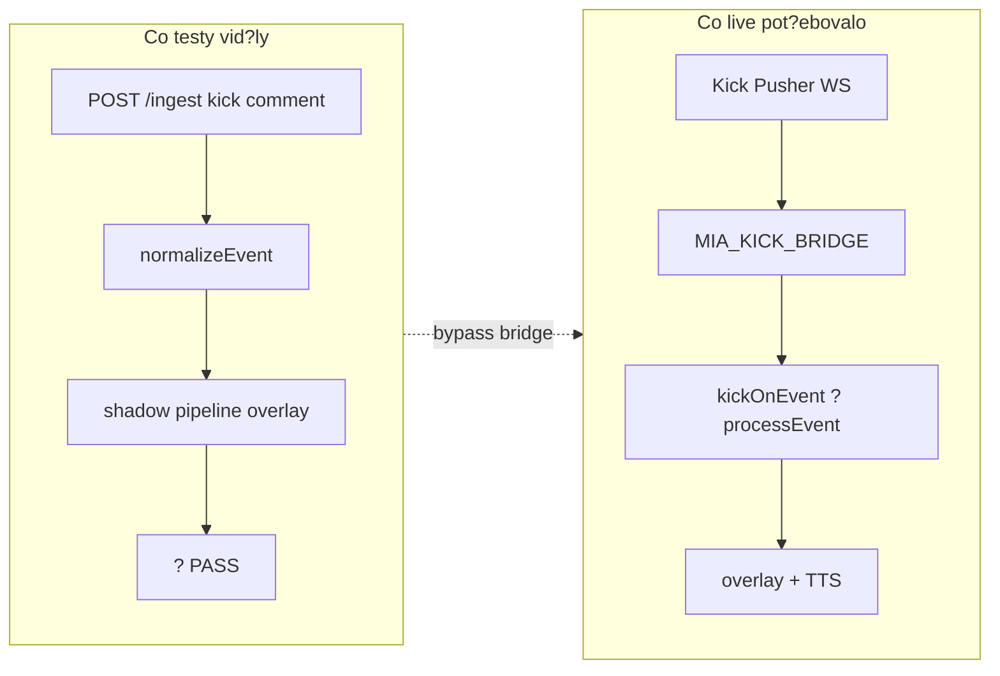

# MIA — Regression gap analysis (Kick chat bridge)

**Datum:** 2026-07-26  
**Kontext:** Kick chat bridge byl mrtvý navzdory 157/157 preflight a guardrailu „nerozbít“. Oprava: `ca80eae7`. Tento dokument vysv?tluje systémovou mezeru a co jsme zatvrdili.

---

## 1. Pro? „nás nerozbít“ selhalo jako proces

Guardrail v `.cursor/rules/mia-guardrails.mdc` je **zám?r a review discipline**, ne automatická pojistka. Bez contract testu na konkrétní cestu m?že regrese projít zeleným preflightem.

Konkrétn? u Kicku:

| Mezera | D?sledek |
|--------|----------|
| Kick je **volitelná/offline** cesta | Preflight nikdy neotev?e live Pusher WS na Kick |
| `.env.example` uvád?l `KICK_CHANNEL`, ale `MIA_CONFIG` ho ne?etl | Dokumentace slibovala wiring, runtime ho ignoroval |
| `startKickBridge` nešet?il `kick.enabled` | Bridge se pokoušel startovat i když operátor cht?l OFF |
| `createKickWebhookBridge(app, path, url)` — špatná signatura | Webhook režim tiše nefungoval |
| Reply testy šly p?es `/ingest` inject | Pipeline „chat reply funguje“ i když bridge mrtvý |

**Záv?r:** Pravidlo „nerozbít“ nebylo porušeno úmysln? — chyb?la **mapa env ? config ? bridge ? health** v testech. Audit potvrdil OBS/gifts/TikFinity; Kick ingress ne.

---

## 2. Co audity pokryly vs. minuly

### Pokryto (mega audit, capability, R1, preflight fast)

- OBS overlaye, gift map, tier rotace, miaPoints public API
- TikFinity HTTP `/ingest` normalizer + shadow pipeline
- Platform bridge **API existence** (`platform_bridges_contract`)
- Health payload **shape** (`health_runtime_contract`) — mock status, ne live bridge
- Graphics R1, Koj runtime, admin simulate wiring v `index.js`

### Minuto (root cause Kick outage)

| Chyb?jící kontrola | Pro? to nesta?ilo |
|--------------------|-------------------|
| Env?config wiring matrix | `KICK_CHANNEL` v docs ? runtime |
| `startKickBridge` respektuje `kick.enabled` | OFF env neblokoval start |
| Live/mock Pusher subscribe | WS path mimo CI |
| `/health` ? `kickBridge.connected` p?i enabled | Test mockoval `{ connected: true }`, ne bootstrap |
| Rozlišení unit path vs live ingress | `/ingest` inject ? bridge forward |

---

## 3. Jak Kick konkrétn? proklouzl

1. **Reply pipeline** — fungovala p?es inject; operátor vid?l zelené testy, live chat ne.
2. **Bridge bootstrap** — `bootstrapPlatformBridges()` volán, ale `kick.enabled` / channel / webhook API broken.
3. **Capability docs** — Kick ozna?en **ON** bez povinného `kickBridge.connected` checku.
4. **Sekundární drift** — `MIA_KICK_BRIDGE_ENABLED` v OBS layout skriptech vs kanonické `MIA_KICK_ENABLED` (default ON v config, layout myslel tiktok).

---

## 4. Opravy a hardening (2026-07-26)

### Už v `ca80eae7`

- `kick.enabled` gate v `startKickBridge`
- `KICK_CHANNEL` ? slug resolve v `MIA_CONFIG` + `resolveKickChatroomId`
- Webhook API `{ app, onEvent }` + in-process forward
- `tests/kick_chat_reply_contract.js` v preflight fast

### Tento audit (`env_wiring` + layout fix)

- `isKickBridgeEnabledFromEnv()` — jednotný zdroj pravdy (`MIA_KICK_ENABLED`, alias `MIA_KICK_BRIDGE_ENABLED`, default ON)
- OBS layout + gift video layout používají helper místo mrtvého env klí?e
- `tests/env_wiring_contract.js` — matrix `.env.example` Kick/Telegram klí?? ? `buildRuntimeConfig`
- Preflight fast: **159 suites** (bylo 158)

### Doporu?ení (backlog, v?tší scope)

1. Integration test: mock Pusher ? `startKickBridge` ? `processEvent` called (bez live sít?)
2. Startup check: fail loud když `kick.enabled` + žádný channel/chatroom a fallback nevhodný
3. Capability status: Kick **ON** jen když `/health.kickBridge.connected === true` na produk?ní instanci
4. `.env.example` contract pro celý soubor (ne jen bridge sekce)

---

## 5. Test výsledky po hardeningu

| P?íkaz | Výsledek |
|--------|----------|
| `node --check index.js` | PASS |
| `npm run test:preflight:fast` | PASS — 159/159 |
| `node tests/env_wiring_contract.js` | PASS |
| `node tests/kick_chat_reply_contract.js` | PASS |

---

## 6. Otev?ené položky (ne kritické pro stream)

| ID | Severity | Popis |
|----|----------|-------|
| OPEN-1 | LOW | Twitch bridge default OFF; `.env.example` nemá Twitch sekci — OK, ale wiring test chybí |
| OPEN-2 | LOW | `/health` nemá `telegramBridge` (jen `/diagnose`) |
| OPEN-3 | LOW | R1-C OBS human gate stále OPEN |
| OPEN-4 | INFO | Kick bez channel spadne na default chatroomId `95746130` — zám?r pro dev, ne loud fail |

---

*Dokument je zám?rn? p?ímý: guardrail bez path-specific contractu nechrání optional ingress.*
