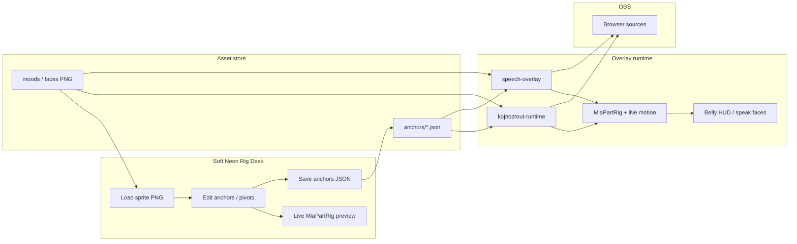

# Návrh: MIA Soft Neon Rig Desk — grafický systém (Build Package v1)

**Stav:** implementováno (Build Package v1) · **Datum:** 2026-07-19  
**Repo:** `C:\MIA`  
**How-to:** `docs/SOFT_NEON_RIG_DESK.md`  
**Související:** `docs/_export_mia_2d_part_rig_plan.md`, `docs/_export_mia_koj_world_unification_proposal.md`, `docs/MIA_GRAPHICS_STUDIO.md`

---

## Verdikt

**Jeden produkt:** **Soft Neon Rig Desk** (zkráceně **Rig Desk**).

Ne další „Animation Studio“ a ne další layer-paint monolit. Je to **úzký, viditelný balíček**: browser editor kotvev + stejný runtime part-rig na MIA i Koji → OBS. Po Build Package v1 divák **hned vidí život** (otáčení hlavy, idle váha, břicho HUD na místě) — ne jen dokument.

**Co shipne Build Package v1 (1–2 sessiony):**

| Dodávka | Výsledek na streamu |
|---------|---------------------|
| Minimální Rig Desk HTML | Načte sprite, táhne kotvy, živý preview part-rig |
| Anchors JSON (sdílené schéma) | Uložení bez editace `koj-body-anchors.js` ručně |
| Runtime MIA + Koj | Stejné kotvy + `MiaPartRig` — head yaw/nod, belly locked |
| Soft Neon world tokens | Jedna paleta / glow jazyk (už částečně v CSS) |
| Volitelně 2–3 part sloty | Clip/mock vrstvy (root / body / head) — ne plné part PNG sheets |

**Mimo v1:** full timeline studio, 3D, AI video pipeline, rozšíření Graphics Studio Phase 13+.

---

## Stav dnes (audit — proč to dává smysl)

### Co už existuje a funguje

| Vrstva | Soubor / místo | Stav |
|--------|----------------|------|
| Part-rig API | `mia-output-overlay/lib/mia-part-rig.js` | v0 — root → torso/body → head, `setLocal`, CSS transforms |
| Koj kotvy | `mia-output-overlay/lib/koj-body-anchors.js` | v24 — belly / head / neck / eye / root / body (hardcoded JS) |
| Koj runtime | `kojnozrout-runtime.html` + `koj-live-motion.js` | Rig + idle life + belly HUD sync |
| MIA runtime | `speech-overlay.html` + `mia-holo-motion.js` | Stejný humanoid chain, pivots zatím ad-hoc |
| Soft Neon tokens | `mia-soft-neon-world.css` | Mint–aqua lab paleta sdílená |
| Paint / Graphics Studio | `/mia-paint/`, `shared/mia-graphics-studio/*` | Silný, ale **příliš široký** pro „hned se hýbe na OBS“ |
| Streamer dashboard | `mia-streamer-dashboard.html` | Odkaz na Graphics Studio / Body API — **chybí Rig Desk** |
| Archivy looků | `assets/kojnozrout/_archive/` | v17…v22 + README — držet, nemazat |

### Co chybí (mezera)

1. **Editor kotvev** — kotvy se editují v JS; žádná stránka „táhni → preview → save JSON“.
2. **JSON jako zdroj pravdy** — runtime čte modul, ne soubor assetů vedle artu.
3. **Jednotný pipeline art → kotvy → OBS** — Graphics Studio dělá paint/AI/timeline; stream potřebuje **úzký Rig Desk**.
4. **Part PNG sheets** — zatím interim clip jedné PNG (hlava); squash celého sprite jako „život“ je zamítnutý.

### Vztah k Graphics Studio

`docs/MIA_GRAPHICS_STUDIO.md` = dlouhodobá vize (paint, timeline, AI, video).  
**Rig Desk v1** = tenký produkt **nad** part-rig runtime, který **nečeká** na maturity timeline/3D. Graphics Studio zůstává knihovnou / pozdější Fází B; stream musí žít teď.

---

## Co stavíme najednou (Build Package v1)

**Constraint:** implementovatelné v **~1–2 sessionách**, minimální diff, OBS-first.

### 1. Soft Neon Rig Desk (browser page)

**URL (návrh):** `/mia-paint/rig-desk.html` nebo `/mia-rig-desk/`  
**Vstup z dashboardu:** tlačítko vedle „Graphics Studio“.

**UI (jedna kompozice, ne dashboard clutter):**

- Plátno se sprite (Koj idle / MIA idle — výběr entity)
- Overlay handles: **belly** (rect), **head** (rect), **neck** (pivot), **eye** (volitelně), **root / body** (pivoty)
- Panel: Live preview ON — procedurální head yaw/nod + lehký root weight (stejné API jako `MiaPartRig`)
- Tlačítka: **Load sprite** · **Reset** · **Copy JSON** · **Save** (POST nebo zápis do `assets/…/anchors.json`)
- Soft Neon chrome (mint glass) — sdílené CSS tokens

**Neobsahuje:** timeline scrubber, vrstvy paintu, AI generate, 3D viewport.

### 2. Anchors JSON schéma (sdílené)

Rozšířit / exportovat tvar z `koj-body-anchors.js` do souboru např.:

```
mia-output-overlay/assets/kojnozrout/anchors/koj-cyborg-v23.json
mia-output-overlay/assets/mia/anchors/mia-soft-neon-v1.json
```

```json
{
  "version": 25,
  "artId": "koj-cyborg-v23",
  "idleAsset": "assets/kojnozrout/moods/kojnozout-idle.png",
  "belly": { "cx": 0.5, "cy": 0.575, "w": 0.36, "h": 0.28 },
  "head": { "cx": 0.5, "cy": 0.3, "w": 0.78, "h": 0.44 },
  "neck": { "x": 0.5, "y": 0.48 },
  "eye": { "cx": 0.62, "cy": 0.255, "w": 0.14, "h": 0.12 },
  "root": { "x": 0.5, "y": 1.0 },
  "body": { "x": 0.5, "y": 0.72 }
}
```

Runtime: `fetch` JSON → fallback na vestavěný `KojBodyAnchors` / MIA defaults.  
Cache bust: `?v=` při změně artu (jako dnes `v=24-koj-PRO-BELLY`).

### 3. Runtime — MIA + Koj používají uložené kotvy

- **Koj:** `ensureKojPartRig()` + belly HUD už kotvy čtou — přepnout na JSON loader; držet layout sync (ne `getBoundingClientRect` transform).
- **MIA:** `speech-overlay` pivots dnes hardcoded → načíst `mia-…-anchors.json`; head clip / slot jako u Koje pokud je.
- **Motion:** `koj-live-motion` / `mia-holo-motion` dál volají `rig.setLocal` — bez whole-PNG squash jako primární život.
- Overlay dál jen `miaPoints` (žádné coins).

### 4. Volitelně: 2–3 part sloty (mock / clip)

Pokud zbývá čas v session 2:

| Slot | Implementace v1 |
|------|-----------------|
| root | celý sprite mount |
| body | torso mount (existující) |
| head | clip z idle PNG **nebo** samostatný head PNG pokud je v assets |

Cíl: vidět **nezávislou rotaci hlavy** kolem neck pivotu. Plné part sheets = Fáze B.

### 5. Shared Soft Neon world tokens

- Držet a mírně rozšířit `mia-soft-neon-world.css` (Rig Desk + overlays + bowl border language).
- Žádný nový brand clash (žádný hard Blade Runner vs cute pet) — viz world unification proposal.

---

## Architektura



**Tok jednou větou:** Editor zapisuje kotvy → overlay je načte → part-rig pohne klouby → OBS jen renderuje.

**Pravidlo architektury:** TikFinity → MIA → OBS. Business logika a kotvy v MIA; OBS bez vlastní „inteligence“.

---

## Celkové vylepšení grafiky (art pipeline)

Jak tvořit assety dál — aby Rig Desk i stream zůstaly v jednom rytmu.

### Soft Neon Companion Lab (svět)

- MIA = něžný holo-guardian (mint–aqua, měkká silueta).
- Koj = živý mazlíček / cyborg pet ve stejném labu.
- Společná podlaha světla / glass chrome; ne tři cizí stickery.

### Part sheets (cíl Fáze B, brief už teď)

| Part | Naming | Canvas |
|------|--------|--------|
| Full / body | `{entity}-{artId}-body.png` | sdílený box (Koj ~512, MIA dle presence) |
| Head | `{entity}-{artId}-head.png` | stejný canvas, transparent mimo hlavu |
| (later) Eye / hand | `{entity}-{artId}-eye.png` | pivots v JSON |

Dokumentovat pivots **vedle artu** (anchors JSON + krátká poznámka v `ART.note`).

### Archivy

- Nikdy nemazat `_archive/` looky (v17 soft-neon … v22 dark-big).
- Nový look = nová složka archivu + `ARCHIVE.json` + install script pattern (jako `kojnozrout_install_*_art.js`).
- Active moods zůstávají v `moods/`; Rig Desk ukládá kotvy k `artId`, ne „globální magické %“.

### Co nedělat

- Squash celého PNG jako hlavní „breathing“.
- Paralelní gift/media pipeline pro belly.
- Skok do 3D / full Animation Studio mockupu, dokud OBS 2D part-rig není čitelný na telefonu.

---

## Fáze po v1

### Fáze B — Part art + lehký timeline (~½–2 dny)

- Skutečné part PNG sheets (root / body / head) místo clipů.
- Jednoduchý keyframe editor: idle / speak / gift pulse na `x/y/rot` partů (reuse nápadů z `mia-paint` timeline **lehce** — ne plné studio).
- Motion: sample timeline **nebo** fallback procedurální sine (jako dnes).
- MIA Soft Neon guardian art set + identity prompt alignment.

### Fáze C — Graphics Studio bridge + později 3D

- Rig Desk ↔ Graphics Studio: „Open in Paint“ / promote bank.
- Plnější timeline / lip / presence (už částečně v Phase 13 kontraktech) — až to **posiluje** stream, ne jako samostatný produkt.
- 3D Animation Studio (user liked mockup) **až** po solidním 2D: stejné sémantické party (root / torso / head), ne druhý pipeline.
- Stream vždy OBS-first; standalone studio je bonus, ne blocker.

---

## Odhad náročnosti

| Balíček | Odhad | Poznámka |
|---------|-------|----------|
| **Build Package v1** | **6–12 h** (1–2 sessiony) | Rig Desk HTML + JSON I/O + runtime loader + dashboard link + Soft Neon polish |
| Fáze B part sheets + mini timeline | 1–3 dny | Art + export + keyframe idle/speak |
| Fáze C studio bridge / 3D | týdny+ | Až po B; 3D až po spokojenosti s 2D na telefonu |

**Rizika v1 (nízká):** save path / static serve; cache bust; MIA vs Koj mírně jiný DOM — řeší se sdíleným schématem + `createStandardHumanoid`.

**Preflight po zásahu:** `node --check` relevantních JS + `npm run test:preflight:fast`.

---

## Doporučení „stavět teď“

**Ano — stavět Build Package v1 (Soft Neon Rig Desk) jako další ucelený zásah**, jakmile řekneš go.

Pořadí uvnitř v1:

1. JSON schéma + loader (Koj first — belly už závisí na kotvách).
2. Minimální Rig Desk page s live `MiaPartRig` preview.
3. Wire MIA pivots na stejné JSON.
4. Dashboard odkaz + Soft Neon chrome.
5. (Bonus) head clip sloty, pokud zbývá čas.

**Ne teď:** full timeline studio, 3D, velké refactory `mia-paint` / Graphics Studio Phase 14.

Tento dokument = export pro rozhodnutí; **implementace až na výslovný pokyn. Bez commitu.**

---

## Klíčové soubory (v1 touch list)

| Účel | Cesta |
|------|--------|
| Rig API | `mia-output-overlay/lib/mia-part-rig.js` |
| Koj kotvy (dnes) | `mia-output-overlay/lib/koj-body-anchors.js` |
| Koj / MIA runtime | `kojnozrout-runtime.html`, `speech-overlay.html` |
| Motion | `koj-live-motion.js`, `mia-holo-motion.js` |
| World tokens | `mia-soft-neon-world.css` |
| Nový editor | `mia-output-overlay/mia-paint/rig-desk.html` (návrh) |
| Nové JSON | `assets/.../anchors/*.json` (návrh) |
| Dashboard | `mia-streamer-dashboard.html` |
| Plán part-rig | `docs/_export_mia_2d_part_rig_plan.md` |
| World vibe | `docs/_export_mia_koj_world_unification_proposal.md` |
